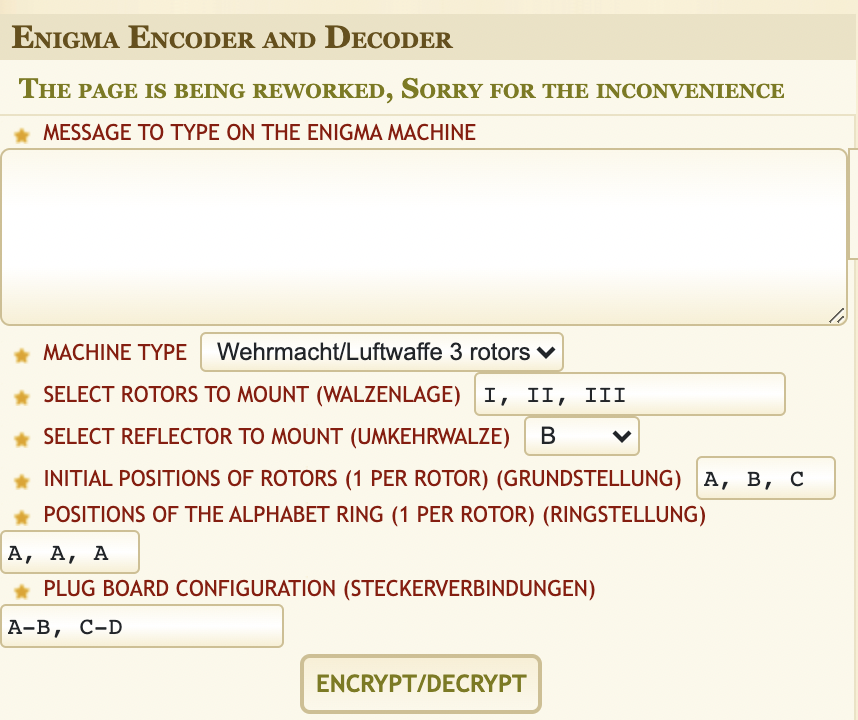
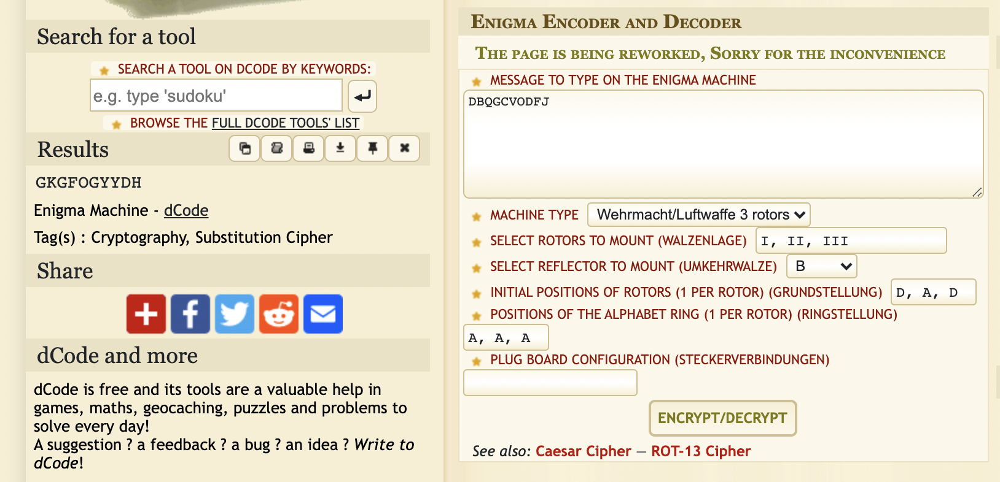

# enigma (crypto)

# Challenge description:

Can you crack this legendary code?

Flag format: CTF{sha256}

# Flag proof:

> ctf{5866e4563bd65bd6746ecb0eab152d59a6690373852d5ea843427fb6dcdd7f1c}

# Summary:

The title leads us to the Engima machine. Connecting to the server gives us some strings and we need to send back the decrypted ones.

# Details:

Connecting via netcat shows this:

```bash
TCC|TQRLVZTPOM  Answer:
```

We can use an Engima Decoder like this one: [https://www.dcode.fr/enigma-machine-cipher](https://www.dcode.fr/enigma-machine-cipher)



The first three letters are the initial positions of rotors, and the rest are the message. The server stops if we didn't answer fast enough, but at least we know if the solution is right. The default options are fine, except for the plugboard, which we need to remove:



The result is GKGFOGYYDH. Let's send it:

```bash
➜  ~ nc 34.159.190.67 30974
DAD|DBQGCVODFJ  Answer: GKGFOGYYDH
Too slow. No skiddies allowed
```

Compare it with a wrong output:

```bash
➜  ~ nc 34.159.190.67 30974
MDG|QNFBGHAGIO  Answer: a
Wrong answer.Try harder!
```

So we got the right answer, but we were too slow to send it. We can create a Python script for it. There is already a package named `pyenigma`

```python
from pyenigma import enigma, rotor

key = input()

machine = enigma.Enigma(
    rotor.ROTOR_Reflector_B,
    rotor.ROTOR_I,
    rotor.ROTOR_II,
    rotor.ROTOR_III,
    key
)

s = input()
print(machine.encipher(s))
```

Trying it on the server, the values are good. We just need to pass the server I/O to the script. We can use `socket` for that:

```python
from pyenigma import enigma, rotor
import socket

def main():
    s = socket.socket(socket.AF_INET, socket.SOCK_STREAM)
    s.connect(("34.159.190.67", 30974))
    while True:
        line = s.recv(1024).strip()
        print(line)
        if b'Wrong' in line:
            main()
        data, _ = line.split(b"  ")
        key, string = data.split(b"|")
        machine = enigma.Enigma(
            rotor.ROTOR_Reflector_B,
            rotor.ROTOR_I,
            rotor.ROTOR_II,
            rotor.ROTOR_III,
            key.decode()
        )
        s.send(machine.encipher(string.decode()).encode() + b"\n")

main()
```

The function is recursive because sometimes the server randomly says the answer is wrong (I don't know why, maybe it's too overloaded) so we just restart the script in that case. After lots of tries, we get the flag:

```python
Congrats. You tamed enigma. Here's your flag: ctf{5866e4563bd65bd6746ecb0eab152d59a6690373852d5ea843427fb6dcdd7f1c}
```
