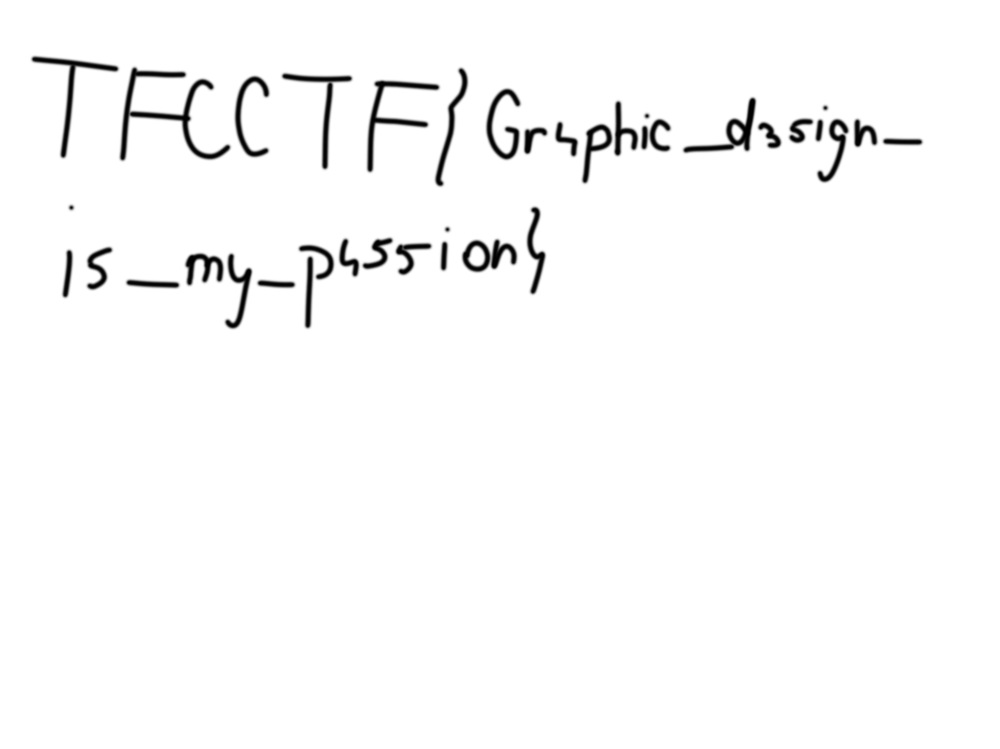

# AAAAA

Let's run `file`:

```bash
❯ file AAAAA
AAAAA: data
```

Let's open it in an editor. We see lots of As, then a PNG stream, then lots of As again. Let's extract the stream between the As:

```python
with open("AAAAA", "rb") as in_file:
    with open("AAAAA.png", "wb") as out_file:
        out_file.write(in_file.read()[2000:-2000])
```


