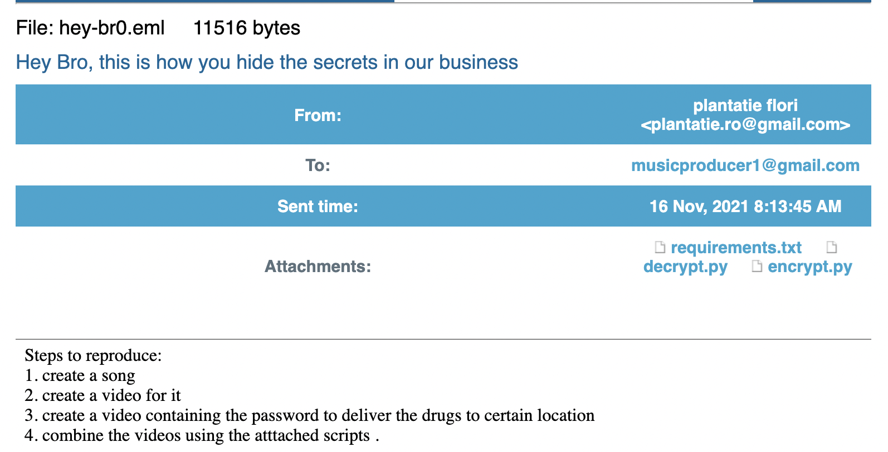
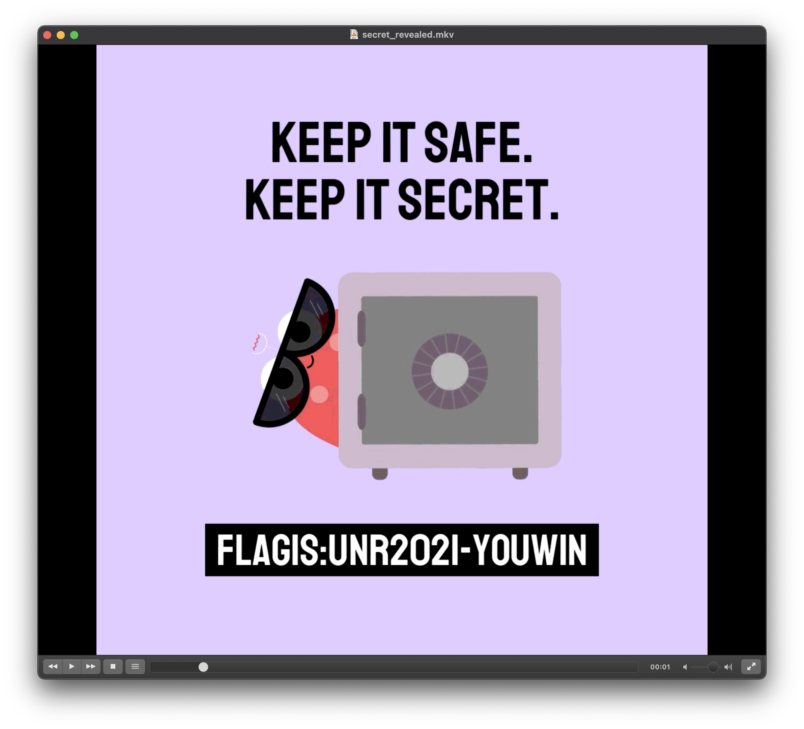

# music-producers-are-now-suspects (forensics)

# Challenge description:

The NY police have captured some laptops and tablets owned by different music producers who are suspected of dealing drugs. We don’t know many details about how this business was going, but we have extracted the below video from the main suspect’s laptop.

# Flag proof:

> UNR2021-YOUWIN

# Summary:

We have an email file and a video. Parsing the email file gives us three files, one of which is a Python script. Running the script on the video gives another video with the flag

# Details:

We have a zip archive which, after extracting, gives us two files:

- covered.mkv
- hey-br0.eml

Let's read the email. We can either open it as text and decode the attachments or use some email viewer online.



We can download the attachments and install the packages in `requirements.txt`.

- requirements.txt

```python
astroid==2.4.2
isort==4.2.5
lazy-object-proxy==1.4.3
mccabe==0.6.1
numpy==1.19.0
opencv-python>=4
pylint==2.5.3
six==1.15.0
toml==0.10.1
tqdm==4.47.0
typed-ast==1.4.1
Wave==0.0.2
wrapt==1.12.1
```

- encrypt.py

```python
import cv2
import numpy as np
import subprocess
import os
from tqdm import tqdm
import wave

# configure for encryption
if not os.path.exists("enc"): os.mkdir("enc")
if not os.path.exists("out"): os.mkdir("out")

# path of cover video and secret video
cover_path = "/home/volf/Downloads/code-of-silence.mp4"
secret_path = "/home/volf/Downloads/world-password-day-copy.mp4"

# counting the frame to tract the position
fn = 0

# -- resize keeping aspect ratio constant -- #
def resize(src, w=None, h=None, ar=None):
    """
    Resizes keeping aspect ratio
    src: Source File
    w: Width to be reached
    h: Height to be reached
    ar: aspect ratio for operation
    """

    if w is not None and h is not None:
        return cv2.resize(src, (w, h))
    assert(ar != None)
    if w is not None:
        return cv2.resize(src, (w, int(w/ar)))
    if h is not None:
        return cv2.resize(src, (int(h*ar), h))

# Video Objects for src and secret
src = cv2.VideoCapture(cover_path)
src_w = int(src.get(3))
src_h = int(src.get(4))
src_fps = src.get(cv2.CAP_PROP_FPS)
src_frame_cnt = src.get(cv2.CAP_PROP_FRAME_COUNT)

sec = cv2.VideoCapture(secret_path)
sec_w = int(sec.get(3))
sec_h = int(sec.get(4))
sec_fps = sec.get(cv2.CAP_PROP_FPS)
sec_frame_cnt = sec.get(cv2.CAP_PROP_FRAME_COUNT)

if src_frame_cnt < sec_frame_cnt:
    print("please choose the cover video with higher duration length than secret video")
    exit()

# working with audio
sec_duration = sec_frame_cnt/sec_fps
subprocess.call(f"ffmpeg -ss 0 -t {sec_duration} -i {cover_path} enc/cvr.wav", shell=True)
subprocess.call(f"ffmpeg -ss 0 -t {sec_duration} -i {secret_path} enc/scr.wav", shell=True)

# encoding audio
# well this technique is very noisy for audio encryption
with wave.open("enc/enc.wav", 'wb') as e:
    s = wave.open("enc/scr.wav", 'rb')
    c = wave.open("enc/cvr.wav", 'rb')
    s_frames = np.array(list(s.readframes(s.getnframes())), dtype='uint8')
    c_frames = np.array(list(c.readframes(c.getnframes())), dtype='uint8')

	# make the shape of frames same
    if s_frames.shape[0]>c_frames.shape[0]:
      c_frames = np.concatenate((c_frames, np.zeros((s_frames.shape[0]-c_frames.shape[0],), dtype='uint8')), axis=0)
    elif s_frames.shape[0]<c_frames.shape[0]:
      s_frames = np.concatenate((s_frames, np.zeros((c_frames.shape[0]-s_frames.shape[0],), dtype='uint8')), axis=0)

    # encryption of audio
    enc_frames = (c_frames&0b11110000)|(s_frames&0b11110000)>>4

    e.setparams(s.getparams())
    e.writeframes(np.ndarray.tobytes(enc_frames))

    s.close()
    c.close()

# create a progress bar
pbar = tqdm(total=sec_frame_cnt*2, unit='frames')

while(1):
    _, src_frame = src.read()
    ret, sec_frame = sec.read()

    if ret == False:
	    break

    # get aspect ratio
    src_ar = src_w/src_h
    sec_ar = sec_w/sec_h

    # secret video may loose video quality if its resolution is higher then cover video
    # -- fit the cover frame -- #
    if src_ar == sec_ar and src_frame.shape < sec_frame.shape:
        sec_frame = resize(sec_frame, src_w, src_h)
    elif src_ar != sec_ar and (src_w < sec_w or src_h < sec_h):
        if sec_w>sec_h:
            sec_frame = resize(sec_frame, w=src_w, ar=sec_ar)
            if sec_frame.shape[0]>src_h:
                sec_frame = resize(sec_frame, h=src_h, ar=sec_ar)
        else:
            sec_frame = resize(sec_frame, h=src_h, ar=sec_ar)
            if sec_frame.shape[1]>src_w:
                sec_frame = resize(sec_frame, w=src_w, ar=sec_ar)

    # -- fill the remaining pixel with black color -- #
    sec_frame = cv2.hconcat([sec_frame, np.zeros((sec_frame.shape[0], src_w-sec_frame.shape[1], 3), dtype='uint8')])
    sec_frame = cv2.vconcat([sec_frame, np.zeros((src_h-sec_frame.shape[0], sec_frame.shape[1], 3), dtype='uint8')])

    # -- encryption for LSB 2 bits -- #
    encrypted_img = (src_frame&0b11111100)|(sec_frame>>4&0b00000011)
    fn = fn + 1
    cv2.imwrite("enc/{}.png".format(fn), encrypted_img)

    # -- encryption for 3rd and 4th bits from LSB side-- #
    encrypted_img = (src_frame&0b11111100)|(sec_frame>>6)
    fn = fn + 1
    cv2.imwrite("enc/{}.png".format(fn), encrypted_img)

    pbar.update(2)

pbar.close()

src.release()
sec.release()

# delete encrypted video if already exists
if os.path.exists("out/covered.mkv"): subprocess.call("rm -r out/covered.mkv", shell=True)

# save the video using ffmpeg as a lossless video
# frame rate is doubled to preserve the speed of cover video
save_vid = "ffmpeg -framerate {} -i enc/%d.png -i enc/enc.wav -c:v copy -c:av copy out/covered.mkv".format(src_fps*2)
subprocess.call(save_vid, shell=True)

# delete the temporary image sequence folder
subprocess.call("rm -r enc", shell=True)
```

- decrypt.py

```python
import cv2
import numpy as np
import os
import subprocess
import wave
from tqdm import tqdm

# ensure if 'out' and 'enc' directories exist
if not os.path.exists("out"): os.mkdr("out")
if not os.path.exists("enc"): os.mkdir("enc")

# path to encrypted file
enc_path = "out/covered.mkv"

# read the encrypted video file
enc = cv2.VideoCapture(enc_path)
enc_w = int(enc.get(3))
enc_h = int(enc.get(4))
enc_fps = enc.get(cv2.CAP_PROP_FPS)
enc_frame_cnt = enc.get(cv2.CAP_PROP_FRAME_COUNT)

# video writer for decoding secret video
out = cv2.VideoWriter('enc/decrypted_secret.avi', cv2.VideoWriter_fourcc(*"MJPG"), enc_fps/2, (enc_w, enc_h))

# working with audio
subprocess.call(f"ffmpeg -i {enc_path} enc/enc.wav", shell=True)

# decoding audio file
with wave.open("enc/dec.wav", 'wb') as d:
    e = wave.open("enc/enc.wav", 'rb')
    e_frames = np.array(list(e.readframes(e.getnframes())), dtype='uint8')

    # decryption of audio
    dec_frames = (e_frames&0b00001111)<<4

    d.setparams(e.getparams())
    d.writeframes(np.ndarray.tobytes(dec_frames))

    e.close()

# frame number
fn = 0

# create a progress bar
pbar = tqdm(total=enc_frame_cnt, unit='frames')

while (1):
    # let's take the decrypted image
    ret, frame = enc.read()

    if ret == False:
        break

    fn = fn + 1

    # for even frames, lower 2 bits are extracted
    # for odd frames, 3rd and 4th bits are extracted
    if (fn%2):
        decrypted_frame = (frame&0b00000011)<<4
    else:
        decrypted_frame = decrypted_frame|(frame&0b00000011)<<6
        out.write(decrypted_frame)

    pbar.update(1)

enc.release()
out.release()

# delete decrypted video if already exists
if os.path.exists("out/secret_revealed.mkv"): subprocess.call("rm -r out/secret_revealed.mkv", shell=True)

# save the secret video to a file
save_vid = "ffmpeg -i enc/decrypted_secret.avi -i enc/dec.wav -c:v copy out/secret_revealed.mkv"
subprocess.call(save_vid, shell=True)

# delete the temporary folder
subprocess.call("rm -r enc", shell=True)
```

Let's try decrypting the video we have. It expects the video in the `out` subfolder, so let's do that. We also need to install `ffmpeg`.

```bash
➜  music-producers-are-now-suspects python3 decrypt.py
ffmpeg version 4.4.1 Copyright (c) 2000-2021 the FFmpeg developers
  built with Apple clang version 13.0.0 (clang-1300.0.29.3)
  configuration: --prefix=/opt/homebrew/Cellar/ffmpeg/4.4.1_3 --enable-shared --enable-pthreads --enable-version3 --cc=clang --host-cflags= --host-ldflags= --enable-ffplay --enable-gnutls --enable-gpl --enable-libaom --enable-libbluray --enable-libdav1d --enable-libmp3lame --enable-libopus --enable-librav1e --enable-librist --enable-librubberband --enable-libsnappy --enable-libsrt --enable-libtesseract --enable-libtheora --enable-libvidstab --enable-libvmaf --enable-libvorbis --enable-libvpx --enable-libwebp --enable-libx264 --enable-libx265 --enable-libxml2 --enable-libxvid --enable-lzma --enable-libfontconfig --enable-libfreetype --enable-frei0r --enable-libass --enable-libopencore-amrnb --enable-libopencore-amrwb --enable-libopenjpeg --enable-libspeex --enable-libsoxr --enable-libzmq --enable-libzimg --disable-libjack --disable-indev=jack --enable-avresample --enable-videotoolbox
  libavutil      56. 70.100 / 56. 70.100
  libavcodec     58.134.100 / 58.134.100
  libavformat    58. 76.100 / 58. 76.100
  libavdevice    58. 13.100 / 58. 13.100
  libavfilter     7.110.100 /  7.110.100
  libavresample   4.  0.  0 /  4.  0.  0
  libswscale      5.  9.100 /  5.  9.100
  libswresample   3.  9.100 /  3.  9.100
  libpostproc    55.  9.100 / 55.  9.100
Guessed Channel Layout for Input Stream #0.1 : stereo
Input #0, matroska,webm, from 'out/covered.mkv':
  Metadata:
    ENCODER         : Lavf57.83.100
  Duration: 00:00:12.00, start: 0.000000, bitrate: 564043 kb/s
  Stream #0:0: Video: png (MPNG / 0x474E504D), rgb24(pc), 1080x1080, 50 fps, 50 tbr, 1k tbn, 1k tbc (default)
    Metadata:
      DURATION        : 00:00:12.000000000
  Stream #0:1: Audio: pcm_s16le, 48000 Hz, stereo, s16, 1536 kb/s (default)
    Metadata:
      DURATION        : 00:00:09.979000000
Stream mapping:
  Stream #0:1 -> #0:0 (pcm_s16le (native) -> pcm_s16le (native))
Press [q] to stop, [?] for help
Output #0, wav, to 'enc/enc.wav':
  Metadata:
    ISFT            : Lavf58.76.100
  Stream #0:0: Audio: pcm_s16le ([1][0][0][0] / 0x0001), 48000 Hz, stereo, s16, 1536 kb/s (default)
    Metadata:
      DURATION        : 00:00:09.979000000
      encoder         : Lavc58.134.100 pcm_s16le
size=    1871kB time=00:00:09.96 bitrate=1538.5kbits/s speed=23.7x
video:0kB audio:1871kB subtitle:0kB other streams:0kB global headers:0kB muxing overhead: 0.004071%
 99%|██████████████████████████████████▋| 594/600.0 [00:06<00:00, 89.42frames/s]ffmpeg version 4.4.1 Copyright (c) 2000-2021 the FFmpeg developers
  built with Apple clang version 13.0.0 (clang-1300.0.29.3)
  configuration: --prefix=/opt/homebrew/Cellar/ffmpeg/4.4.1_3 --enable-shared --enable-pthreads --enable-version3 --cc=clang --host-cflags= --host-ldflags= --enable-ffplay --enable-gnutls --enable-gpl --enable-libaom --enable-libbluray --enable-libdav1d --enable-libmp3lame --enable-libopus --enable-librav1e --enable-librist --enable-librubberband --enable-libsnappy --enable-libsrt --enable-libtesseract --enable-libtheora --enable-libvidstab --enable-libvmaf --enable-libvorbis --enable-libvpx --enable-libwebp --enable-libx264 --enable-libx265 --enable-libxml2 --enable-libxvid --enable-lzma --enable-libfontconfig --enable-libfreetype --enable-frei0r --enable-libass --enable-libopencore-amrnb --enable-libopencore-amrwb --enable-libopenjpeg --enable-libspeex --enable-libsoxr --enable-libzmq --enable-libzimg --disable-libjack --disable-indev=jack --enable-avresample --enable-videotoolbox
  libavutil      56. 70.100 / 56. 70.100
  libavcodec     58.134.100 / 58.134.100
  libavformat    58. 76.100 / 58. 76.100
  libavdevice    58. 13.100 / 58. 13.100
  libavfilter     7.110.100 /  7.110.100
  libavresample   4.  0.  0 /  4.  0.  0
  libswscale      5.  9.100 /  5.  9.100
  libswresample   3.  9.100 /  3.  9.100
  libpostproc    55.  9.100 / 55.  9.100
[mjpeg @ 0x133019600] EOI missing, emulating
Input #0, avi, from 'enc/decrypted_secret.avi':
  Metadata:
    software        : Lavf58.76.100
  Duration: 00:00:12.00, start: 0.000000, bitrate: 10669 kb/s
  Stream #0:0: Video: mjpeg (Baseline) (MJPG / 0x47504A4D), yuvj420p(pc, bt470bg/unknown/unknown), 1080x1080, 10691 kb/s, 25 fps, 25 tbr, 25 tbn, 25 tbc
Guessed Channel Layout for Input Stream #1.0 : stereo
Input #1, wav, from 'enc/dec.wav':
  Duration: 00:00:09.98, bitrate: 1536 kb/s
  Stream #1:0: Audio: pcm_s16le ([1][0][0][0] / 0x0001), 48000 Hz, stereo, s16, 1536 kb/s
Stream mapping:
  Stream #0:0 -> #0:0 (copy)
  Stream #1:0 -> #0:1 (pcm_s16le (native) -> vorbis (libvorbis))
Press [q] to stop, [?] for help
Output #0, matroska, to 'out/secret_revealed.mkv':
  Metadata:
    software        : Lavf58.76.100
    encoder         : Lavf58.76.100
  Stream #0:0: Video: mjpeg (Baseline) (MJPG / 0x47504A4D), yuvj420p(pc, bt470bg/unknown/unknown), 1080x1080, q=2-31, 10691 kb/s, 25 fps, 25 tbr, 1k tbn, 25 tbc
  Stream #0:1: Audio: vorbis (oV[0][0] / 0x566F), 48000 Hz, stereo, fltp
    Metadata:
      encoder         : Lavc58.134.100 libvorbis
frame=  300 fps=0.0 q=-1.0 Lsize=   15780kB time=00:00:11.96 bitrate=10807.4kbits/s speed=93.9x
video:15609kB audio:147kB subtitle:0kB other streams:0kB global headers:4kB muxing overhead: 0.156417%
100%|███████████████████████████████████| 600/600.0 [00:06<00:00, 86.97frames/s]
```

We now have a `secret-revealed.mkv`


