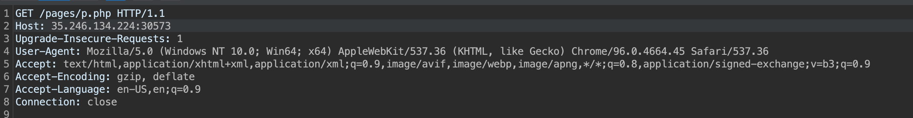
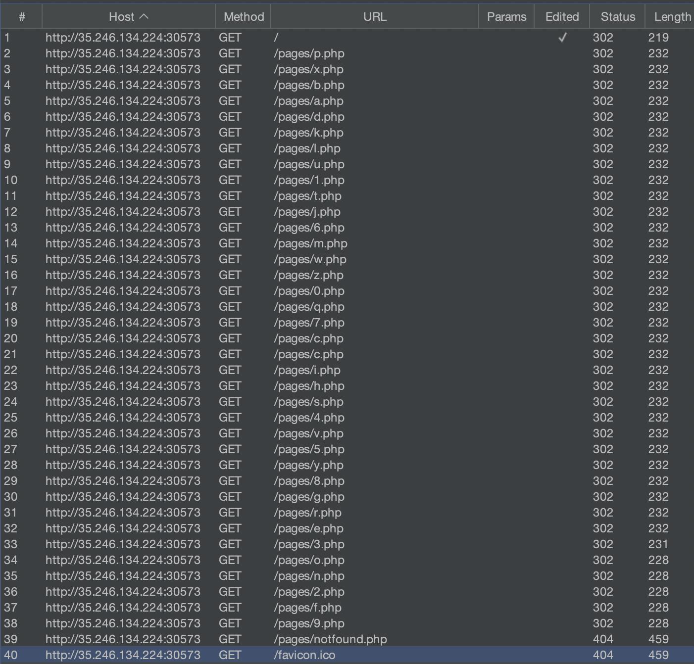
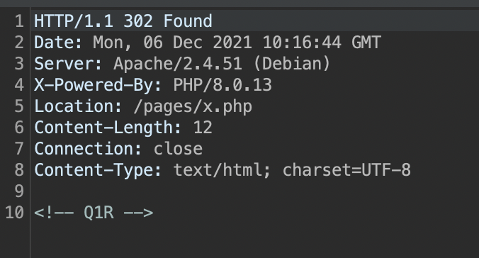
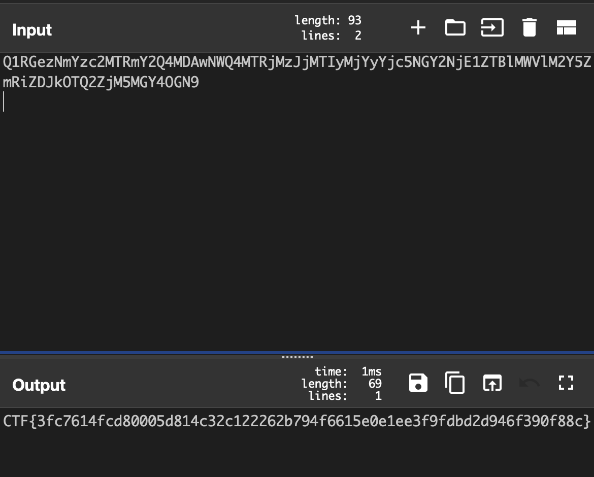
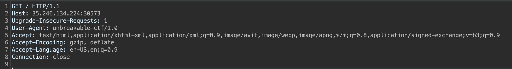

# dizzy (misc)

# Challenge description:

We received a strange link in an email and we don't know what it is about. Someone might be trying to send us a hidden message. Could you have a look and see if you find anything interesting?

Flag format: CTF{sha256}

# Flag proof:

> CTF{3fc7614fcd80005d814c32c122262b794f6615e0e1ee3f9fdbd2d946f390f88c}

# Summary:

We need to read `robots.txt`, change the user agent, then we get the flag

# Details:

If we open the link, we see an empty page. One of the first things to check is `robots.txt`:

```c
User-Agent: curl/7.54.1
Disallow: *
User-Agent: curl/7.56.2
Disallow: *
User-Agent: curl/7.44.3
Disallow: *
User-Agent: curl/7.48.5
Disallow: *
User-Agent: curl/7.48.3
Disallow: *
User-Agent: curl/7.46.0
Disallow: *
User-Agent: curl/7.41.4
Disallow: *
User-Agent: curl/7.49.3
Disallow: *
User-Agent: curl/7.40.2
Disallow: *
User-Agent: curl/7.41.3
Disallow: *
User-Agent: curl/7.48.8
Disallow: *
User-Agent: curl/7.54.2
Disallow: *
User-Agent: curl/7.51.4
Disallow: *
User-Agent: curl/7.53.1
Disallow: *
User-Agent: curl/7.55.3
Disallow: *
User-Agent: curl/7.56.1
Disallow: *
User-Agent: curl/7.57.1
Disallow: *
User-Agent: curl/7.59.0
Disallow: *
User-Agent: curl/7.53.0
Disallow: *
User-Agent: curl/7.55.5
Disallow: *
User-Agent: curl/7.51.4
Disallow: *
User-Agent: curl/7.59.2
Disallow: *
User-Agent: curl/7.55.3
Disallow: *
User-Agent: curl/7.59.1
Disallow: *
User-Agent: curl/7.60.1
Disallow: *
User-Agent: curl/7.50.1
Disallow: *
User-Agent: curl/7.50.2
Disallow: *
User-Agent: curl/7.44.3
Disallow: *
User-Agent: curl/7.48.5
Disallow: *
User-Agent: curl/7.48.3
Disallow: *
User-Agent: curl/7.56.1
Disallow: *
User-Agent: curl/7.57.1
Disallow: *
User-Agent: curl/7.59.0
Disallow: *
User-Agent: curl/7.53.0
Disallow: *
User-Agent: curl/7.55.5
Disallow: *
User-Agent: curl/7.51.4
Disallow: *
User-Agent: curl/7.59.2
Disallow: *
User-Agent: curl/7.55.3
Disallow: *
User-Agent: curl/7.46.0
Disallow: *
User-Agent: curl/7.41.4
Disallow: *
User-Agent: curl/7.49.3
Disallow: *
User-Agent: curl/7.40.2
Disallow: *
User-Agent: curl/7.41.3
Disallow: *
User-Agent: curl/7.48.8
Disallow: *
User-Agent: curl/7.57.1
Disallow: *
User-Agent: curl/7.59.0
Disallow: *
User-Agent: curl/7.53.0
Disallow: *
User-Agent: curl/7.55.5
Disallow: *
User-Agent: curl/7.51.4
Disallow: *
User-Agent: curl/7.59.2
Disallow: *
User-Agent: curl/7.55.3
Disallow: *
User-Agent: curl/7.59.1
Disallow: *
User-Agent: curl/7.60.1
Disallow: *
User-Agent: curl/7.50.1
Disallow: *
User-Agent: curl/7.50.2
Disallow: *
User-Agent: curl/7.44.3
Disallow: *
User-Agent: curl/7.48.5
Disallow: *
User-Agent: curl/7.48.3
Disallow: *
User-Agent: curl/7.46.0
Disallow: *
User-Agent: curl/7.41.4
Disallow: *
User-Agent: curl/7.49.3
Disallow: *
User-Agent: curl/7.40.2
Disallow: *
User-Agent: curl/7.41.3
Disallow: *
User-Agent: curl/7.48.8
Disallow: *
User-Agent: unbreakable-ctf/1.0
Allow: *
```

We see an interesting user agent there. Let's force that agent in Burp Suite.



We get a redirect:



And then another one. Lots of redirects, each one with a page with a single letter ending in `.php`, until `notfound.php`.



Each page contains a comment with some letters:



Most probably they need to be merged and decoded from base64. The `c.php` appears twice, but only needs to be inserted once:


