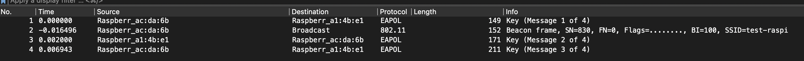

# neighborhood (network)

# Challenge description:

Just moved into a new neighborhood and until my internet is set up I've been connected to an open network bun my friendly neighbor has set a password on it. I've captured some attempts for connection but I couldn't get the password can you help me? Flag format CTF{sha256(password)}.

# Flag proof:

> CTF{E82F09E8FBA98F9F7F0244790568AE49C1E6D2E3517EDA99D9940A64C8440B88}

# Summary:

We have a pcap file with a handshake and we can bruteforce the wifi password there

# Details:

We open the file in Wireshark and we see 4 requests:



Looks like a handshake, and from the description we know we need to find out the password. We can easily crack the password with `aircrack-ng`:

```bash
└─$ aircrack-ng '/home/parallels/Desktop/neighborhood.pcap' -w /usr/share/wordlists/rockyou.txt
Reading packets, please wait...
Opening /home/parallels/Desktop/neighborhood.pcap
Read 4 packets.

   #  BSSID              ESSID                     Encryption

   1  DC:A6:32:AC:DA:6B  test-raspi                WPA (1 handshake)

Choosing first network as target.

Reading packets, please wait...
Opening /home/parallels/Desktop/neighborhood.pcap
Read 4 packets.

1 potential targets

                               Aircrack-ng 1.6

      [00:00:01] 1219/10303727 keys tested (1060.30 k/s)

      Time left: 2 hours, 41 minutes, 56 seconds                 0.01%

                          KEY FOUND! [ mickeymouse ]

      Master Key     : 38 1B CF B7 B7 2C C4 31 C8 25 1F 27 75 EB CF 3B
                       F3 F6 79 93 A4 94 9D 09 A7 76 41 5D 40 85 2B F6

      Transient Key  : B7 43 A8 4F 87 16 2F 8E 07 9F 02 18 D5 B2 6C FE
                       20 A7 BD C7 D1 5B 05 80 1F 32 23 92 0A F1 73 F4
                       51 F5 5A 22 7E 3F D8 0E 9C 84 47 D1 91 FA 33 9D
                       B2 D2 C4 7F 52 F4 6C F2 F7 89 14 1A 4B DE F6 00

      EAPOL HMAC     : ED BF 01 1B CB C6 19 4B 8B 84 7E 43 6E 5A CC 4F
```

The password is `mickeymouse`, we just need to sha256 it.
