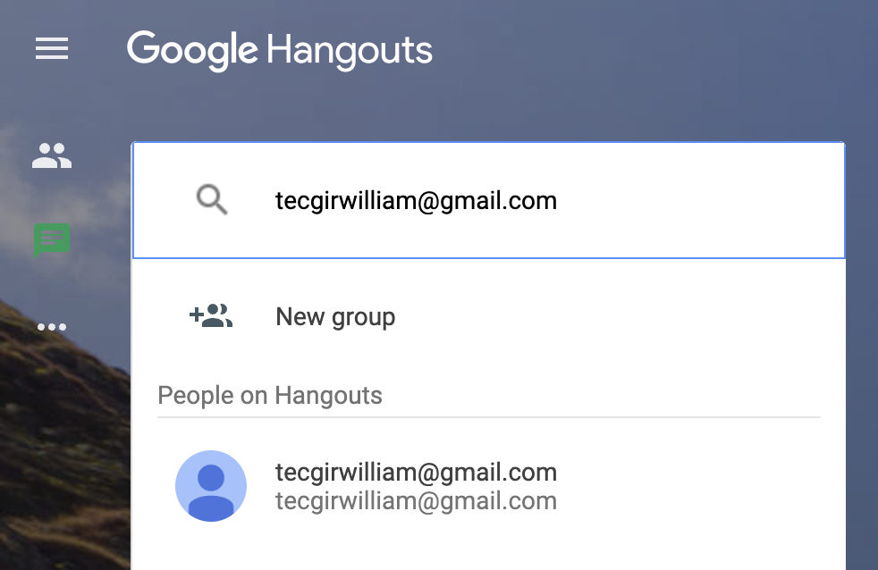
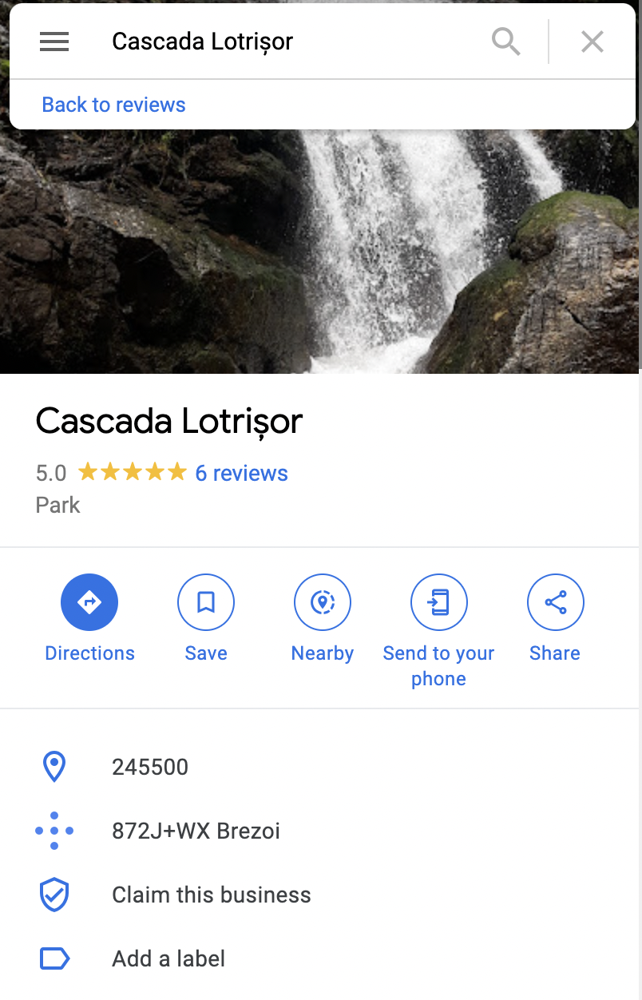
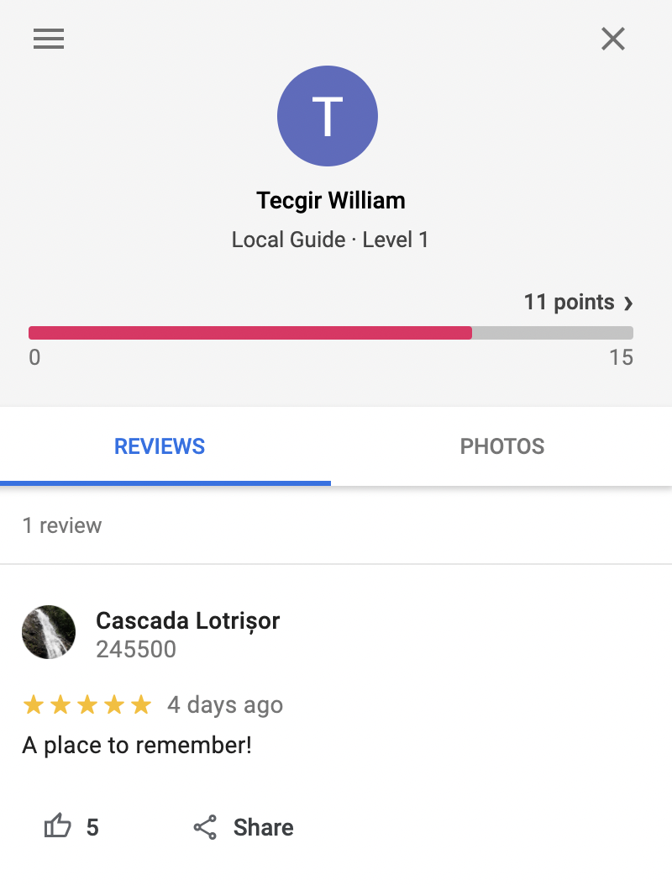

# social-agency (OSINT)

# Challenge description:

Dear Agent, as your first task within the Agency, find the last known location of [tecgirwilliam@gmail.com](mailto:tecgirwilliam@gmail.com) also called Tecgir William without attempting to hack or bruteforce within any account. All information is of course public. After that maybe we can have that call over Google Hangouts/Meets (or both) about how to clean the cafeteria.

Note: The flag of this code must be generated as such: CTF{sha256sum('Google Plus Code')}

# Flag proof:

> CTF{E0C34F6FFE1DCC87C67A4FA218B1050DA7BB9B9D01871EA7AFCB49E55B81257D}

# Summary:

We are given an email address and a hint with Google Hangouts. Also the flag is the hash of a Google Plus Code (from Maps), so we need to see a connection between the two

# Details:

We can get the person's id from Hangouts.



If we look in the console, we see a request made to [`https://people-pa.clients6.google.com/v2/people/lookup?key=](https://people-pa.clients6.google.com/v2/people/lookup?key=)...` that contains the following response:

```json
{
	"matches": [
    {
      "lookupId": "tecgirwilliam@gmail.com",
      "personId": [
        "111076247952673225160"
      ]
    }
  ],
...
```

So the person id is `111076247952673225160`. Let's see their activity on Maps by visiting [`https://www.google.com/maps/contrib/111076247952673225160`](https://www.google.com/maps/contrib/111076247952673225160):



We have a place, let's open it:



The Google Plus Code is `872J+WX Brezoi`, and its hash is `E0C34F6FFE1DCC87C67A4FA218B1050DA7BB9B9D01871EA7AFCB49E55B81257D`. So the flag is:

```c
 CTF{E0C34F6FFE1DCC87C67A4FA218B1050DA7BB9B9D01871EA7AFCB49E55B81257D}
```
