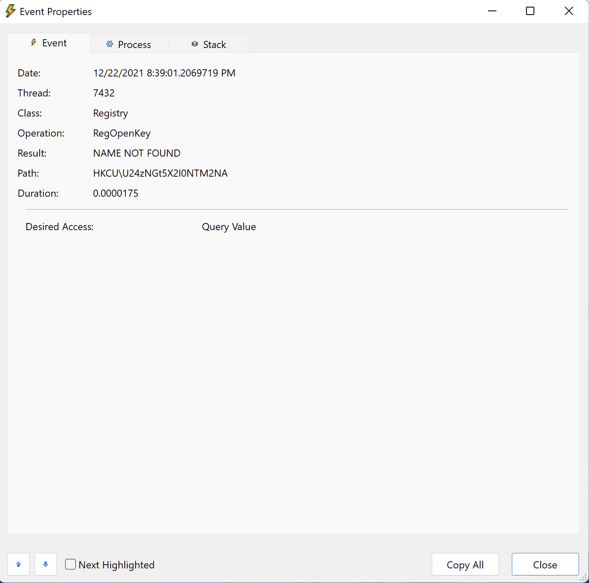
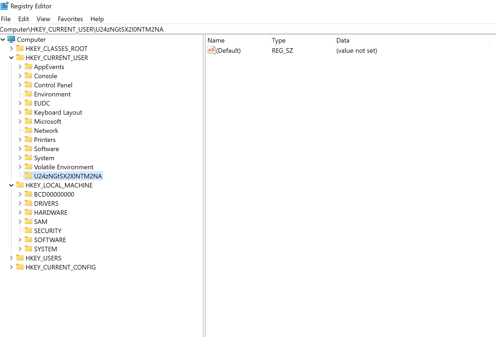
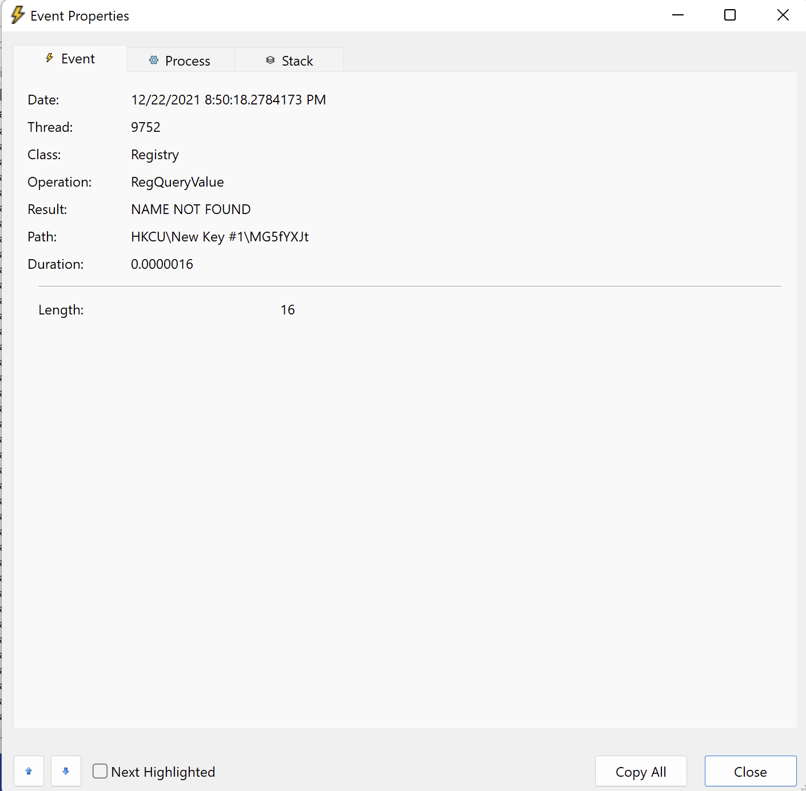

# an arm and a leg

We have an ARM Windows executable and we need to find out what data the binary is reading. We open the binary in a disassembler, and we can see that it tries to read something from the Registry. The easiest way to figure out what it reads is by opening Process Monitor:

HKCU (HKEY_CURRENT_USER, constant for 2147483649), and value `U24zNGt5X2I0NTM2NA`, which decoded from base64 is `Sn34ky_b45364`

To get the other path segment, we have to create that key in the hive:

Run the app again and check the new event:

`MG5fYXJt` decoded is `0n_arm`

So the final flag is: `TFCCTF{RegGetDword_HKEY_CURRENT_USER_2147483649_Sn34ky_b45364_U24zNGt5X2I0NTM2NA_0n_arm_MG5fYXJt}`
