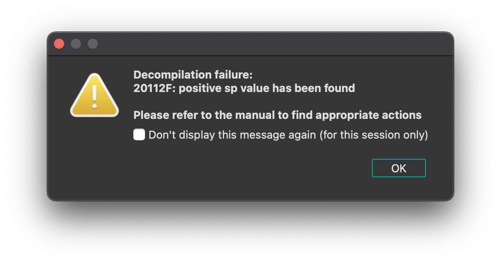
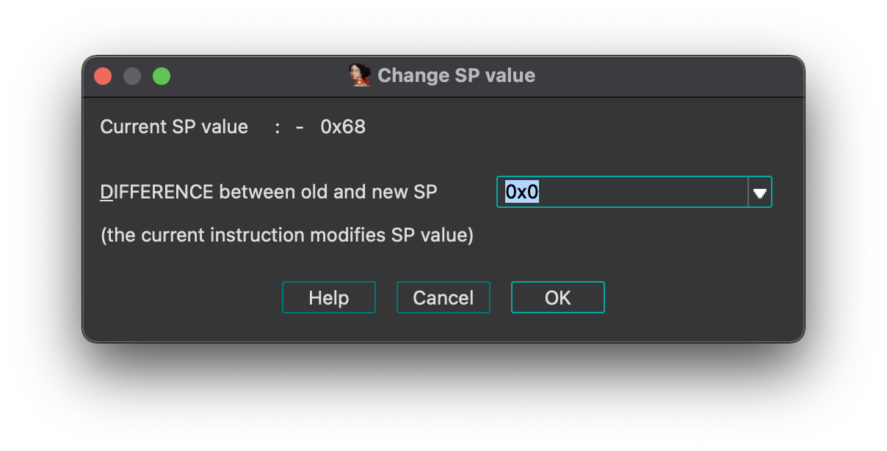

# leprechaun (rev)

# Challenge description:

Get the flag from the pot at the end of the rainbow.

Flag format: UNR{mesaj}

# Flag proof:

> UNR{doubloon_schiling_ducat}

# Summary:

At first glance, the binary only executes a `puts` call. But there is another function that transforms some strings, resulting in the flag. We can either replicate the code in that function or we can run the code in gdb

# Details:

Let's open the binary in IDA. We see 2 interesting functions (well, blocks of code, as the binary is stripped):

- main

```c
__int64 __fastcall main(int a1, char **a2, char **a3)
{
  puts("You are the pot of gold at the end of my rainbow.");
  return 0LL;
}
```

- sub_201010

When we try to decompile the second function, we get an error:



We can fix this by going into the IDA options, General, then check `Stack pointer` and `line prefixes`. We now have the value of SP and the address of the instruction next to every assembly instruction:

```c
.pot:0000000000201010 000 push    rbp
.pot:0000000000201011 008 mov     rbp, rsp
.pot:0000000000201014 008 sub     rsp, 60h
.pot:0000000000201018 068 mov     [rbp+var_58], rdi
.pot:000000000020101C 068 mov     rax, fs:28h
.pot:0000000000201025 068 mov     [rbp+var_8], rax
.pot:0000000000201029 068 xor     eax, eax
.pot:000000000020102B 068 mov     [rbp+var_30], 31h ; '1'
.pot:000000000020102F 068 mov     [rbp+var_2F], 3Bh ; ';'
.pot:0000000000201033 068 mov     [rbp+var_2E], 30h ; '0'
...
```

We look at the IDA logs:

```c
20112F: positive sp value has been found
```

Right click where the instruction at that address is, `Change stack pointer`



Input 0xd0 (0x68 \* 2) and we can finally decompile it:

```c
unsigned __int64 __fastcall sub_201010(__int64 a1)
{
  unsigned int i; // [rsp+1Ch] [rbp-44h]
  char v3[25]; // [rsp+22h] [rbp-3Eh] BYREF
  char v4[29]; // [rsp+3Bh] [rbp-25h] BYREF
  unsigned __int64 v5; // [rsp+58h] [rbp-8h]

  v5 = __readfsqword(0x28u);
  v3[17] = 23;
  v3[18] = 13;
  v3[19] = 1;
  v3[20] = 42;
  v3[21] = 5;
  v3[22] = 25;
  v3[23] = 6;
  v3[24] = 1;
  strcpy(v4, "\v,");
  v4[3] = 7;
  v4[4] = 29;
  v4[5] = 11;
  v4[6] = 0;
  v4[7] = 0;
  v4[8] = 0;
  v4[9] = 56;
  v4[10] = 56;
  v4[11] = 17;
  v4[12] = 28;
  v4[13] = 13;
  v4[14] = 4;
  v4[15] = 7;
  v4[16] = 14;
  qmemcpy(v3, "dublin_guiness1;0", 17);
  for ( i = 0; i <= 0x1B; ++i )
    *(_BYTE *)(i + a1) = v3[i % 0xE] ^ v3[i + 14];
  return __readfsqword(0x28u) ^ v5;
}
```

I tried executing this code separately, but the flag was corrupted. Either I made a mistake, or IDA decompiled it wrong. But anyway, I decided to just run it in gdb. IDA tells us this function is at offset 0x201010. Let's run `checksec`:

```c
gdb-peda$ checksec
CANARY    : disabled
FORTIFY   : disabled
NX        : ENABLED
PIE       : ENABLED
RELRO     : FULL
```

PIE is enabled, so we need to add the offset to the base address. PIE isn't an inconvenience here, as we don't try to run the binary on the server. We just want to know the result of the function

```c
gdb-peda$ info proc map
process 3173
Mapped address spaces:

          Start Addr           End Addr       Size     Offset objfile
      0x555555400000     0x555555401000     0x1000        0x0 /home/toma/unbreakable/leprechaun/leprechaun
      0x555555600000     0x555555602000     0x2000        0x0 /home/toma/unbreakable/leprechaun/leprechaun
      0x7ffff7fc2000     0x7ffff7fc6000     0x4000        0x0 [vvar]
      0x7ffff7fc6000     0x7ffff7fc8000     0x2000        0x0 [vdso]
      0x7ffff7fc8000     0x7ffff7fc9000     0x1000        0x0 /usr/lib/x86_64-linux-gnu/ld-linux-x86-64.so.2
      0x7ffff7fc9000     0x7ffff7ff1000    0x28000     0x1000 /usr/lib/x86_64-linux-gnu/ld-linux-x86-64.so.2
      0x7ffff7ff1000     0x7ffff7ffb000     0xa000    0x29000 /usr/lib/x86_64-linux-gnu/ld-linux-x86-64.so.2
      0x7ffff7ffb000     0x7ffff7fff000     0x4000    0x32000 /usr/lib/x86_64-linux-gnu/ld-linux-x86-64.so.2
      0x7ffffffde000     0x7ffffffff000    0x21000        0x0 [stack]
  0xffffffffff600000 0xffffffffff601000     0x1000        0x0 [vsyscall]
```

So the function is at 0x555555400000 + 0x201010 = 0x555555601010

Let's jump here:

```c
gdb-peda$ set $pc = 0x555555601010
gdb-peda$ context
[----------------------------------registers-----------------------------------]
RAX: 0x0
RBX: 0x0
RCX: 0x0
RDX: 0x0
RSI: 0x0
RDI: 0x0
RBP: 0x0
RSP: 0x7fffffffe4c0 --> 0x1
RIP: 0x555555601010 --> 0x60ec8348e5894855
R8 : 0x0
R9 : 0x0
R10: 0x0
R11: 0x0
R12: 0x0
R13: 0x0
R14: 0x0
R15: 0x0
EFLAGS: 0x200 (carry parity adjust zero sign trap INTERRUPT direction overflow)
[-------------------------------------code-------------------------------------]
   0x55555560100a:	and    BYTE PTR [rax],al
   0x55555560100c:	add    BYTE PTR [rax],al
   0x55555560100e:	add    BYTE PTR [rax],al
=> 0x555555601010:	push   rbp
   0x555555601011:	mov    rbp,rsp
   0x555555601014:	sub    rsp,0x60
   0x555555601018:	mov    QWORD PTR [rbp-0x58],rdi
   0x55555560101c:	mov    rax,QWORD PTR fs:0x28
[------------------------------------stack-------------------------------------]
0000| 0x7fffffffe4c0 --> 0x1
0008| 0x7fffffffe4c8 --> 0x7fffffffe712 ("/home/toma/unbreakable/leprechaun/leprechaun")
0016| 0x7fffffffe4d0 --> 0x0
0024| 0x7fffffffe4d8 --> 0x7fffffffe73f ("LC_CTYPE=UTF-8")
0032| 0x7fffffffe4e0 --> 0x7fffffffe74e ("USER=toma")
0040| 0x7fffffffe4e8 --> 0x7fffffffe758 ("LOGNAME=toma")
0048| 0x7fffffffe4f0 --> 0x7fffffffe765 ("HOME=/home/toma")
0056| 0x7fffffffe4f8 --> 0x7fffffffe775 ("PATH=/home/toma/.cargo/bin:/usr/local/sbin:/usr/local/bin:/usr/sbin:/usr/bin:/sbin:/bin:/usr/games:/usr/local/games:/snap/bin")
[------------------------------------------------------------------------------]
Legend: code, data, rodata, value
gdb-peda$
```

This is the correct function. If we look in IDA, the function has an argument (named by IDA `a1`). At the end of the function we see that it is writing to it (`(_BYTE *)(i + a1) =` ) at the offset of `i`, so it looks like a buffer allocated by the caller. We look at the other segments to see if we can find a writeable memory zone large enough (`i` goes until 0x1b inclusive), but we don't find any. But we can reserve some space on the stack. Let the program execute its prologue:

```c
[----------------------------------registers-----------------------------------]
RAX: 0x0
RBX: 0x0
RCX: 0x0
RDX: 0x0
RSI: 0x0
RDI: 0x0
RBP: 0x7fffffffe4b8 --> 0x0
RSP: 0x7fffffffe458 --> 0x0
RIP: 0x555555601018 --> 0x48b4864a87d8948
R8 : 0x0
R9 : 0x0
R10: 0x0
R11: 0x0
R12: 0x0
R13: 0x0
R14: 0x0
R15: 0x0
EFLAGS: 0x202 (carry parity adjust zero sign trap INTERRUPT direction overflow)
[-------------------------------------code-------------------------------------]
   0x555555601010:	push   rbp
   0x555555601011:	mov    rbp,rsp
   0x555555601014:	sub    rsp,0x60
=> 0x555555601018:	mov    QWORD PTR [rbp-0x58],rdi
   0x55555560101c:	mov    rax,QWORD PTR fs:0x28
   0x555555601025:	mov    QWORD PTR [rbp-0x8],rax
   0x555555601029:	xor    eax,eax
   0x55555560102b:	mov    BYTE PTR [rbp-0x30],0x31
[------------------------------------stack-------------------------------------]
0000| 0x7fffffffe458 --> 0x0
0008| 0x7fffffffe460 --> 0x0
0016| 0x7fffffffe468 --> 0x0
0024| 0x7fffffffe470 --> 0x0
0032| 0x7fffffffe478 --> 0x0
0040| 0x7fffffffe480 --> 0x0
0048| 0x7fffffffe488 --> 0x0
0056| 0x7fffffffe490 --> 0x0
[------------------------------------------------------------------------------]
Legend: code, data, rodata, value
0x0000555555601018 in ?? ()
gdb-peda$
```

The easiest way to make space on the stack is to jump again to the previous instruction (`sub rsp,0x60`).

```c
gdb-peda$ set $pc = 0x555555601014
gdb-peda$ context
[----------------------------------registers-----------------------------------]
RAX: 0x0
RBX: 0x0
RCX: 0x0
RDX: 0x0
RSI: 0x0
RDI: 0x0
RBP: 0x7fffffffe4b8 --> 0x0
RSP: 0x7fffffffe458 --> 0x0
RIP: 0x555555601014 --> 0xa87d894860ec8348
R8 : 0x0
R9 : 0x0
R10: 0x0
R11: 0x0
R12: 0x0
R13: 0x0
R14: 0x0
R15: 0x0
EFLAGS: 0x202 (carry parity adjust zero sign trap INTERRUPT direction overflow)
[-------------------------------------code-------------------------------------]
   0x55555560100e:	add    BYTE PTR [rax],al
   0x555555601010:	push   rbp
   0x555555601011:	mov    rbp,rsp
=> 0x555555601014:	sub    rsp,0x60
   0x555555601018:	mov    QWORD PTR [rbp-0x58],rdi
   0x55555560101c:	mov    rax,QWORD PTR fs:0x28
   0x555555601025:	mov    QWORD PTR [rbp-0x8],rax
   0x555555601029:	xor    eax,eax
[------------------------------------stack-------------------------------------]
0000| 0x7fffffffe458 --> 0x0
0008| 0x7fffffffe460 --> 0x0
0016| 0x7fffffffe468 --> 0x0
0024| 0x7fffffffe470 --> 0x0
0032| 0x7fffffffe478 --> 0x0
0040| 0x7fffffffe480 --> 0x0
0048| 0x7fffffffe488 --> 0x0
0056| 0x7fffffffe490 --> 0x0
[------------------------------------------------------------------------------]
Legend: code, data, rodata, value
gdb-peda$
```

Let the instruction execute:

```c
gdb-peda$ si

[----------------------------------registers-----------------------------------]
RAX: 0x0
RBX: 0x0
RCX: 0x0
RDX: 0x0
RSI: 0x0
RDI: 0x0
RBP: 0x7fffffffe4b8 --> 0x0
RSP: 0x7fffffffe3f8 --> 0x0
RIP: 0x555555601018 --> 0x48b4864a87d8948
R8 : 0x0
R9 : 0x0
R10: 0x0
R11: 0x0
R12: 0x0
R13: 0x0
R14: 0x0
R15: 0x0
EFLAGS: 0x202 (carry parity adjust zero sign trap INTERRUPT direction overflow)
[-------------------------------------code-------------------------------------]
   0x555555601010:	push   rbp
   0x555555601011:	mov    rbp,rsp
   0x555555601014:	sub    rsp,0x60
=> 0x555555601018:	mov    QWORD PTR [rbp-0x58],rdi
   0x55555560101c:	mov    rax,QWORD PTR fs:0x28
   0x555555601025:	mov    QWORD PTR [rbp-0x8],rax
   0x555555601029:	xor    eax,eax
   0x55555560102b:	mov    BYTE PTR [rbp-0x30],0x31
[------------------------------------stack-------------------------------------]
0000| 0x7fffffffe3f8 --> 0x0
0008| 0x7fffffffe400 --> 0x0
0016| 0x7fffffffe408 --> 0x0
0024| 0x7fffffffe410 --> 0x0
0032| 0x7fffffffe418 --> 0x0
0040| 0x7fffffffe420 --> 0x0
0048| 0x7fffffffe428 --> 0x0
0056| 0x7fffffffe430 --> 0x0
[------------------------------------------------------------------------------]
Legend: code, data, rodata, value
0x0000555555601018 in ?? ()
gdb-peda$
```

Now, the next instruction copies the first argument (from RDI) in the stack. RDI is 0 (we haven't called the function properly, just jumped to it), but we made space on the stack for it. Let's take for example RBP - 0x100

```c
gdb-peda$ p $rbp - 0x100
$2 = (void *) 0x7fffffffe3b8
```

And set RDI to that value:

```c
gdb-peda$ set $rdi = 0x7fffffffe3b8
```

Now we have everything set up to call the function. Let's continue running.

```c
[----------------------------------registers-----------------------------------]
RAX: 0x0
RBX: 0x0
RCX: 0x0
RDX: 0x0
RSI: 0x0
RDI: 0x7fffffffe3b8 --> 0x0
RBP: 0x7fffffffe4b8 --> 0x0
RSP: 0x7fffffffe3f8 --> 0x0
RIP: 0x55555560101c --> 0x2825048b4864
R8 : 0x0
R9 : 0x0
R10: 0x0
R11: 0x0
R12: 0x0
R13: 0x0
R14: 0x0
R15: 0x0
EFLAGS: 0x10202 (carry parity adjust zero sign trap INTERRUPT direction overflow)
[-------------------------------------code-------------------------------------]
   0x555555601011:	mov    rbp,rsp
   0x555555601014:	sub    rsp,0x60
   0x555555601018:	mov    QWORD PTR [rbp-0x58],rdi
=> 0x55555560101c:	mov    rax,QWORD PTR fs:0x28
   0x555555601025:	mov    QWORD PTR [rbp-0x8],rax
   0x555555601029:	xor    eax,eax
   0x55555560102b:	mov    BYTE PTR [rbp-0x30],0x31
   0x55555560102f:	mov    BYTE PTR [rbp-0x2f],0x3b
[------------------------------------stack-------------------------------------]
0000| 0x7fffffffe3f8 --> 0x0
0008| 0x7fffffffe400 --> 0x0
0016| 0x7fffffffe408 --> 0x0
0024| 0x7fffffffe410 --> 0x0
0032| 0x7fffffffe418 --> 0x0
0040| 0x7fffffffe420 --> 0x0
0048| 0x7fffffffe428 --> 0x0
0056| 0x7fffffffe430 --> 0x0
[------------------------------------------------------------------------------]
Legend: code, data, rodata, value
Stopped reason: SIGSEGV
0x000055555560101c in ?? ()
gdb-peda$
```

We have a segmentation fault at the instruction that tries to read the canary from the FS segment, either because we forcibly jumped to the function, or because the function is not used in the program and a canary hasn't been created. Anyway, the canary is not relevant, so we can just set the program counter to the instruction below and continue. We will get another segmentation fault in the function epilogue when it tries to read the canary again, so we don't need to set another breakpoint to see the result:

```c
gdb-peda$ set $pc = 0x555555601025
gdb-peda$ c
Continuing.

Program received signal SIGSEGV, Segmentation fault.

[----------------------------------registers-----------------------------------]
RAX: 0x0
RBX: 0x0
RCX: 0x73 ('s')
RDX: 0x7d ('}')
RSI: 0x7d ('}')
RDI: 0x7fffffffe3b8 ("UNR{doubloon_schiling_ducat}")
RBP: 0x7fffffffe4b8 --> 0x0
RSP: 0x7fffffffe3f8 --> 0x0
RIP: 0x555555601124 --> 0x282504334864
R8 : 0x0
R9 : 0x0
R10: 0x0
R11: 0x0
R12: 0x0
R13: 0x0
R14: 0x0
R15: 0x0
EFLAGS: 0x10202 (carry parity adjust zero sign trap INTERRUPT direction overflow)
[-------------------------------------code-------------------------------------]
   0x55555560111d:	jbe    0x5555556010dc
   0x55555560111f:	nop
   0x555555601120:	mov    rax,QWORD PTR [rbp-0x8]
=> 0x555555601124:	xor    rax,QWORD PTR fs:0x28
   0x55555560112d:	je     0x555555601134
   0x55555560112f:	call   0x555555601134
   0x555555601134:	leave
   0x555555601135:	ret
[------------------------------------stack-------------------------------------]
0000| 0x7fffffffe3f8 --> 0x0
0008| 0x7fffffffe400 --> 0x0
0016| 0x7fffffffe408 --> 0x0
0024| 0x7fffffffe410 --> 0x0
0032| 0x7fffffffe418 --> 0x0
0040| 0x7fffffffe420 --> 0x0
0048| 0x7fffffffe428 --> 0x0
0056| 0x7fffffffe430 --> 0x0
[------------------------------------------------------------------------------]
Legend: code, data, rodata, value
Stopped reason: SIGSEGV
0x0000555555601124 in ?? ()
gdb-peda$
```

The RDI register contains the address we allocated on the stack for the result, which is also the flag!
