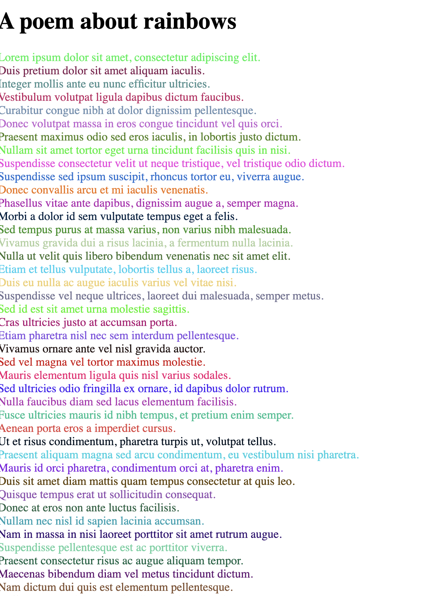
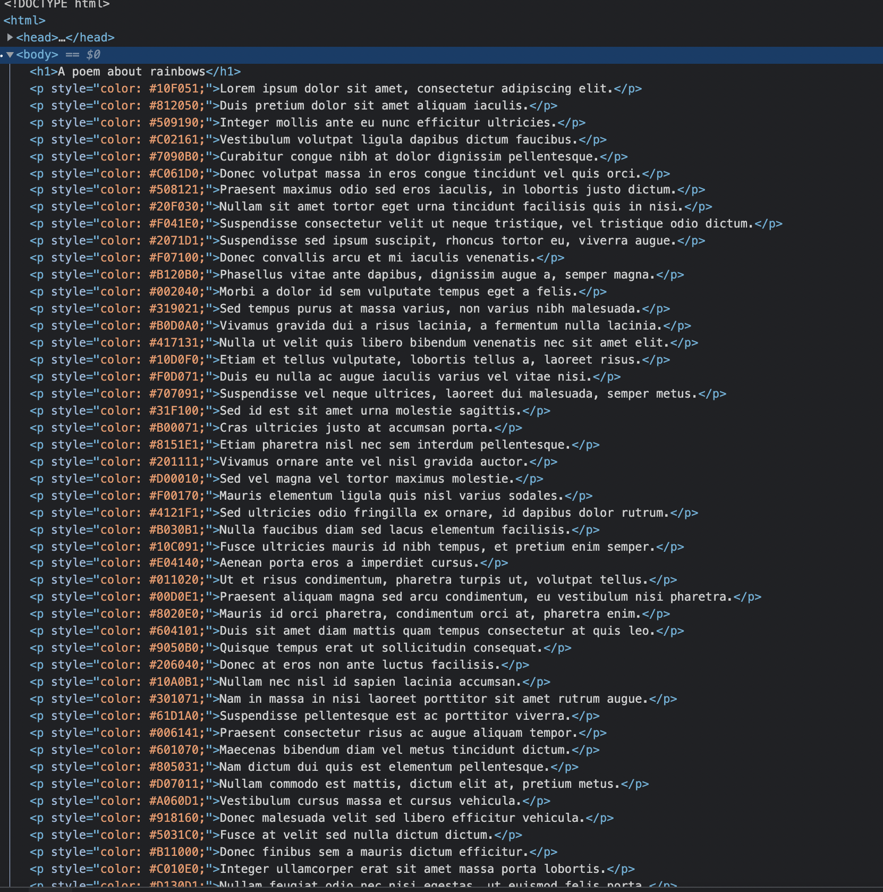
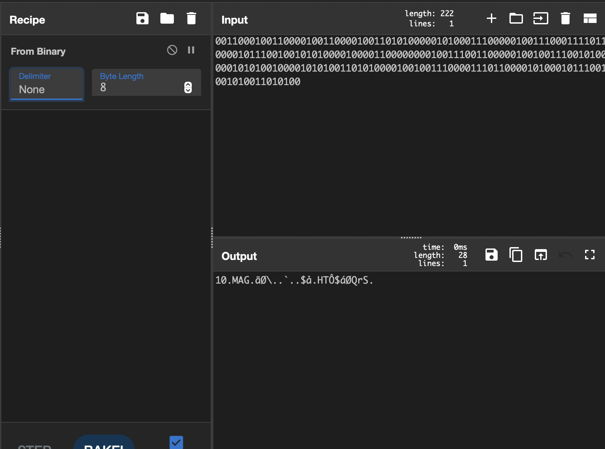
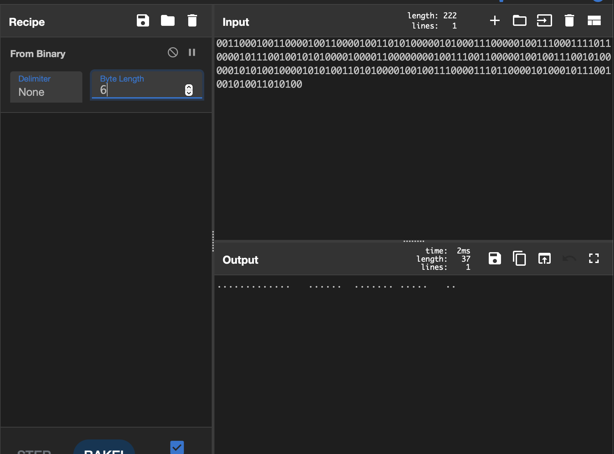
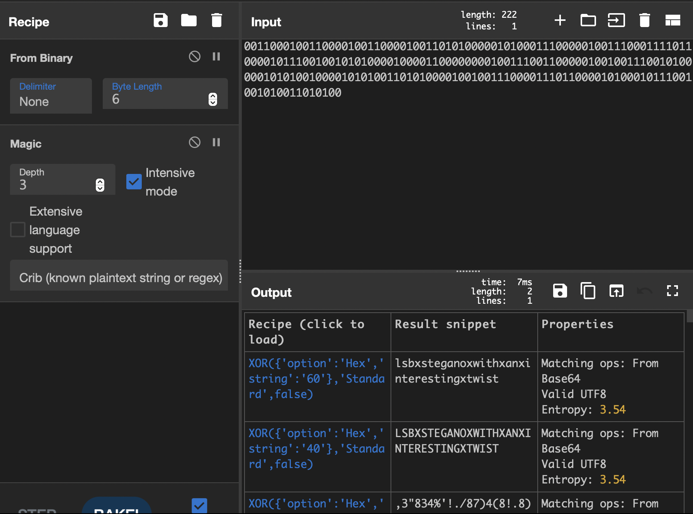

# rainbow (stego)

# Challenge description:

We suspect that someone was trying to hide information in plain text. However, our team could not find anything useful. Maybe you can do better!

Flag format: CTF{leak}

# Flag proof:

> CTF{lsbxsteganoxwithxanxinterestingxtwist}

# Summary:

The page contains some lorem ipsum text colored randomly each time the page is refreshed. We can extract data from the common parts of the colors, then decode it into the leak

# Details:

We are presented with a page with a lot of colored lines



Refreshing the page also randomizes the colors. Let's look in the inspector:



Let's refresh the page a few times. We see that every color ends with 0 or 1, no matter how many times it has been refreshed. And it's the same digit each time. Same thing for the second digit and the fourth. Let's extract them:

```python
html = {
    '#902091': 'Lorem ipsum dolor sit amet, consectetur adipiscing elit.',
    '#D1E0B0': 'Duis pretium dolor sit amet aliquam iaculis.',
    '#90B140': 'Integer mollis ante eu nunc efficitur ultricies.',
    '#10B1F1': 'Vestibulum volutpat ligula dapibus dictum faucibus.',
    '#5080B0': 'Curabitur congue nibh at dolor dignissim pellentesque.',
    '#C0E1B0': 'Donec volutpat massa in eros congue tincidunt vel quis orci.',
    '#209101': 'Praesent maximus odio sed eros iaculis, in lobortis justo dictum.',
    '#7000B0': 'Nullam sit amet tortor eget urna tincidunt facilisis quis in nisi.',
    '#40D190': 'Suspendisse consectetur velit ut neque tristique, vel tristique odio dictum.',
    '#B0F161': 'Suspendisse sed ipsum suscipit, rhoncus tortor eu, viverra augue.',
    '#E0C1C0': 'Donec convallis arcu et mi iaculis venenatis.',
    '#8190C0': 'Phasellus vitae ante dapibus, dignissim augue a, semper magna.',
    '#D0E020': 'Morbi a dolor id sem vulputate tempus eget a felis.',
    '#C1B021': 'Sed tempus purus at massa varius, non varius nibh malesuada.',
    '#30F080': 'Vivamus gravida dui a risus lacinia, a fermentum nulla lacinia.',
    '#D1A121': 'Nulla ut velit quis libero bibendum venenatis nec sit amet elit.',
    '#5030E0': 'Etiam et tellus vulputate, lobortis tellus a, laoreet risus.',
    '#40B021': 'Duis eu nulla ac augue iaculis varius vel vitae nisi.',
    '#E01031': 'Suspendisse vel neque ultrices, laoreet dui malesuada, semper metus.',
    '#9191D0': 'Sed id est sit amet urna molestie sagittis.',
    '#A070B1': 'Cras ultricies justo at accumsan porta.',
    '#F1A131': 'Etiam pharetra nisl nec sem interdum pellentesque.',
    '#509101': 'Vivamus ornare ante vel nisl gravida auctor.',
    '#C0A020': 'Sed vel magna vel tortor maximus molestie.',
    '#F01130': 'Mauris elementum ligula quis nisl varius sodales.',
    '#E17101': 'Sed ultricies odio fringilla ex ornare, id dapibus dolor rutrum.',
    '#405011': 'Nulla faucibus diam sed lacus elementum facilisis.',
    '#10B0F1': 'Fusce ultricies mauris id nibh tempus, et pretium enim semper.',
    '#D07140': 'Aenean porta eros a imperdiet cursus.',
    '#0160F0': 'Ut et risus condimentum, pharetra turpis ut, volutpat tellus.',
    '#605081': 'Praesent aliquam magna sed arcu condimentum, eu vestibulum nisi pharetra.',
    '#6010D0': 'Mauris id orci pharetra, condimentum orci at, pharetra enim.',
    '#E09111': 'Duis sit amet diam mattis quam tempus consectetur at quis leo.',
    '#F0A0E0': 'Quisque tempus erat ut sollicitudin consequat.',
    '#D07040': 'Donec at eros non ante luctus facilisis.',
    '#708061': 'Nullam nec nisl id sapien lacinia accumsan.',
    '#B0D021': 'Nam in massa in nisi laoreet porttitor sit amet rutrum augue.',
    '#5191D0': 'Suspendisse pellentesque est ac porttitor viverra.',
    '#D08181': 'Praesent consectetur risus ac augue aliquam tempor.',
    '#B02020': 'Maecenas bibendum diam vel metus tincidunt dictum.',
    '#908031': 'Nam dictum dui quis est elementum pellentesque.',
    '#90F041': 'Nullam commodo est mattis, dictum elit at, pretium metus.',
    '#C06021': 'Vestibulum cursus massa et cursus vehicula.',
    '#016190': 'Donec malesuada velit sed libero efficitur vehicula.',
    '#601170': 'Fusce at velit sed nulla dictum dictum.',
    '#F10070': 'Donec finibus sem a mauris dictum efficitur.',
    '#40A060': 'Integer ullamcorper erat sit amet massa porta lobortis.',
    '#8160E1': 'Nullam feugiat odio nec nisi egestas, ut euismod felis porta.',
    '#600170': 'Morbi finibus lorem nec quam efficitur, ut cursus eros sagittis.',
    '#20C170': 'Pellentesque accumsan ante in blandit tincidunt.',
    '#909060': 'Donec ut felis quis nunc commodo interdum vulputate a lectus.',
    '#C1F041': 'Nullam eget ipsum ultrices, malesuada leo ut, egestas erat.',
    '#4001C0': 'Donec semper justo eu libero commodo, vel posuere tellus dapibus.',
    '#D091D1': 'Etiam efficitur arcu sit amet ante ornare iaculis.',
    '#307170': 'Donec sodales nibh sed dignissim feugiat.',
    '#61E080': 'Phasellus bibendum nulla et tortor malesuada tempor.',
    '#601021': 'Vivamus vestibulum ex eget mattis interdum.',
    '#403031': 'Maecenas varius ante et metus faucibus, nec ornare lorem consequat.',
    '#301091': 'Curabitur ac magna eu ante placerat maximus faucibus at sapien.',
    '#1191F0': 'In interdum dolor eget mattis euismod.',
    '#C03080': 'Etiam posuere nunc accumsan velit pulvinar, ac suscipit nunc fringilla.',
    '#E111B1': 'Nullam interdum magna ac scelerisque laoreet.',
    '#30A1B1': 'Cras ac quam eget ante malesuada luctus.',
    '#C070A0': 'Praesent molestie leo varius lorem auctor ornare sit amet nec tellus.',
    '#203190': 'Praesent sed purus laoreet metus finibus tempus.',
    '#F180F0': 'Nullam quis dolor ultrices lorem congue commodo ac sit amet nibh.',
    '#10B1C0': 'Praesent eget erat vel risus porttitor faucibus vel vitae ipsum.',
    '#B18171': 'Nam aliquet nulla et sapien fermentum pharetra.',
    '#70F091': 'Donec vestibulum risus malesuada dui pellentesque iaculis.',
    '#E05071': 'Donec eu quam ut odio laoreet vehicula.',
    '#C001A0': 'Vestibulum aliquet eros vel nulla fermentum, id porta sem elementum.',
    '#60D191': 'Fusce interdum leo at odio consectetur luctus.',
    '#60E1B0': 'Duis ac tortor et ligula tristique fermentum nec at dolor.',
    '#D160B0': 'Pellentesque pellentesque turpis vel nulla porttitor luctus.',
}
print("".join([k[2] + k[4] + k[6] for k in html.keys()]))
```

```python
001100010011000010011000010011010100000101000111000001001110001111011000010111001001010100001000011000000001001110011000001001001110010100000101010010000101010011010100001001001110000111011000010100010111001001010011010100
```

Let's use CyberChef, first thing decoding from binary:



Doesn't look good, let's separate them by 6 bytes instead of 8:



Looks interesting. Maybe some morse code? Nope. Let's use the magic recipe:



The first option looks very promising. Wrapping it in CTF{} gives us the flag
