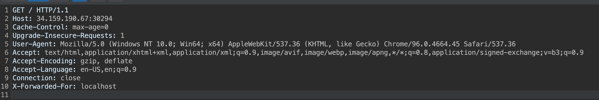
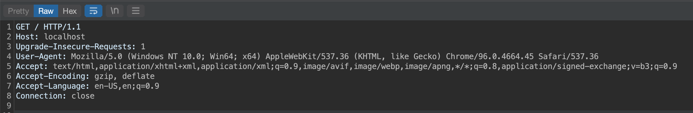
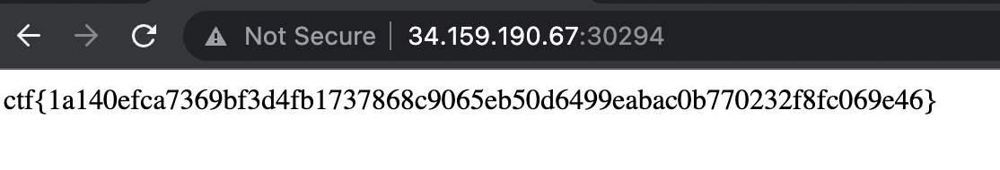

# external-access (web)

# Challenge description:

We are all using it at some point. Don't you agree?

Flag format: CTF{sha256}

# Flag proof:

> ctf{1a140efca7369bf3d4fb1737868c9065eb50d6499eabac0b770232f8fc069e46}

# Summary:

The challenge is all about bypassing the check on the server that verifies whether the request comes from inside or outside

# Details:

The page only contains the following text: `External Access Denied!`. So we need to trick the server the request was made from the inside. Let's open it in Burp Suite. A common method of bypassing is using a `X-Forwarded-For` header:

...but it doesn't seem to work. Let's try with the `Host` header and we get the flag:

