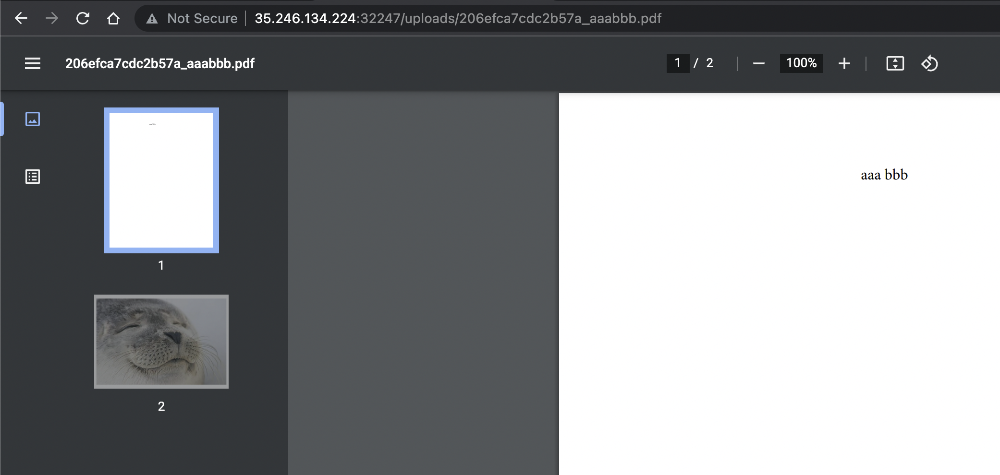

# seal_of_approval (web)

# Challenge description:

Are you part of this seal hacking team?

Flag format: CTF{sha256}

# Flag proof:

> CTF{8c3866c937c5793f747f1b100a3035626813937afcad956afadcc71d91b1fb32}

# Summary:

The page is a pdf uploader that inserts a page at the end with a cute seal. The name of the file contains the text in the pdf and can be forged in order to obtain arbitrary code execution in shell

# Details:


The page has a file upload input and only accepts PDFs. Let's test if it really accepts only PDFs:

```json
{
  "message": "Sorry bro, we only deal in PDFs here"
}
```

Same thing happens if don't upload any file. Let's try with a file that is not a pdf but it has a `.pdf` extension:

```json
{
  "message": "An error occurred when processing the PDF"
}
```

Let's upload a real pdf instead, starting with a blank one:

```json
{
  "message": "An error occurred when processing the PDF"
}
```

The title of the page says that **All your PDFs must contain an eloquent title in order to receive the seal of approval**, so let's try one with some text inside:


We can see that it shows us our PDF with another page added at the end with a cute seal. We look at the url and see that the file is `<hash>_<text>.pdf`. If we upload the same file again, we have a different hash. Most probably so that two PDFs with the same content do not overwrite each other.

Multiple texts seem to be concatenated:


I tried accessing a file that does not exist, and this error came up:

```json
Internal Server Error
The server encountered an internal error and was unable to complete your request. Either the server is overloaded or there is an error in the application.
```

Accessing a url outside `uploads` that does not exist has a different error:

```json
Not Found
The requested URL was not found on the server. If you entered the URL manually please check your spelling and try again.
```

At this point I randomly tried different symbols in the PDF to see if we can achieve some kind of injection


Looks like `aaa$bbb` transformed into only `aaa` in the URL, which gives shell injection vibes. Let's try a known variable, such as `$LANG`:


Indeed it's a shell! We can also try `$$` to prove this once more:


Let's see what happens when we input text with spaces:



The spaces seem to be eliminated. What happens if we try to execute commands?


I don't know whether it executed it or not, but it was clearly removed. Same thing with `$(whoami)`. Arithmetic operations inside `$(())` seem to work fine, but it doesn't help us.

I did some research on shell injection (every CTF I participate in I think I know every shell trick, but every time I learn something new) and found out that we can modify the `IFS` variable so we don't need spaces


Doesn't seem to output anything. But let's test this theory on a local shell. I wasted a lot of time because I was using `zsh` and the trick didn't seem to work, but at some point I decided to try it in bash:

```bash
bash-3.2$ IFS=^;cat^flag.txt
bash: cat^flag.txt: command not found
bash-3.2$
```

Doesn't seem to work, but let's try assigning it to a variable:

```bash
bash-3.2$ IFS=^;pls=cat^flag.txt
bash-3.2$ $pls
cat: flag.txt: No such file or directory
```

Well, looks good. Let's try it on the server and we get our flag:


